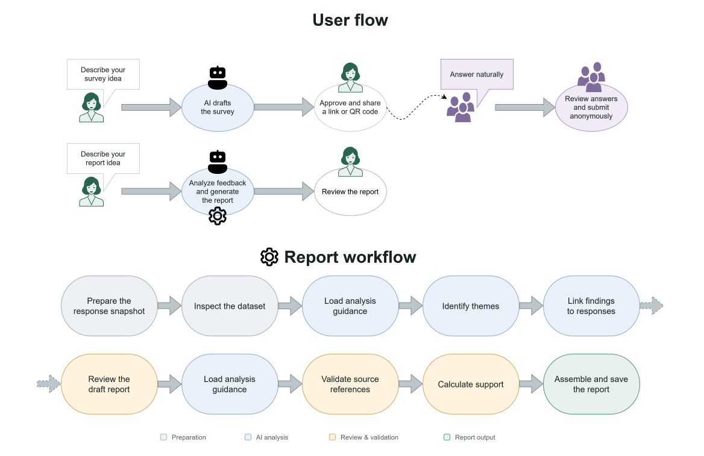
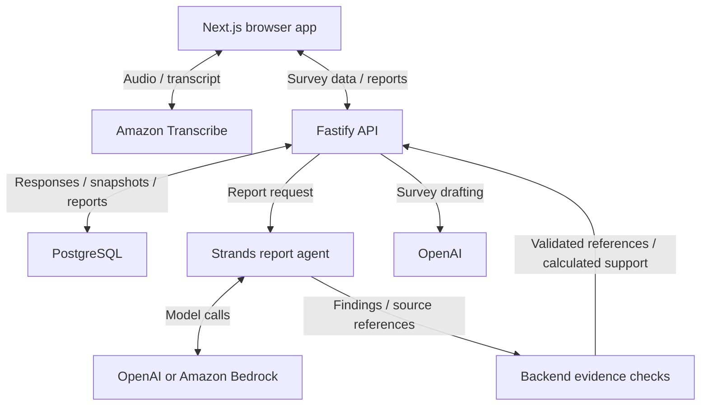

<div align="center">


# Saywide

**EVERYONE HAS SOMETHING TO SAY**

Build a survey with AI. Collect answers by voice. Saywide's agent turns voices into better decisions.

[Visit Saywide](https://saywide.com) · [Demo video](https://www.youtube.com/watch?v=dtRBhO6HJOA) · [How it works](#how-it-works) · [Run locally](#local-development)

**Powered by the AWS Strands Agents SDK**

</div>

---

## The problem

**Two hundred messages in the group chat. A yes-or-no poll. Still no decision.**

Busy chats bury concerns, and simple polls miss the reasons behind an answer. Community organizers are left reading messages, grouping repeated ideas, counting support, and writing summaries before anyone can act.

**Saywide takes on that work.** People share their views in their own words. The agent turns their responses into structured, evidence-backed reports, helping organizers identify shared priorities and concerns that deserve attention.

Built for the **[Good Neighbor Agents track](https://agentsforhumans.devpost.com/)**, Saywide helps parent representatives, school communities, and local organizations spend less effort processing feedback and more time acting on it together.

## How it works

1. **Create with AI.** Open [Saywide](https://saywide.com), click **Get started**, and continue as a guest. Create a survey and speak your idea; AI drafts the title, description, and questions for you to review.
2. **Publish and listen.** Share the link or QR code. Participants answer anonymously by voice or text, review their answers, and submit. No participant account is needed.
3. **Ask for a report.** Choose **Overall picture** or describe what you want to find out. Watch the agent's progress, then explore findings, supporting quotes, and suggested actions.

> **Try this example:** Ask Grade 2 parents about their concerns and suggestions. Then request: “Which concerns come up most, and what should we raise with the school?”

<div align="center">
  
</div>

<p align="center"><a href="docs/saywide-flow.svg">View the full-size diagram</a></p>

## What the agent does

Once the organizer requests a report, the **AWS Strands Agents SDK** runs the reporting workflow, guided by [report skills](backend/skills/):

- Analyzes anonymous responses against the organizer's question or goal.
- Groups related ideas and identifies shared priorities and less common concerns.
- Connects findings to source responses and selects supporting quotes.
- Produces a structured report with insights and suggested actions.

**Evidence checks run in code.** The backend validates source references and calculates support counts and percentages from a fixed response snapshot. Support figures refer to the responses included in that snapshot.

The organizer sets the focus; the agent handles the analysis. People can inspect the evidence and decide what to do next.

## Architecture

<details>
<summary>Architecture diagram, stack, and data flow</summary>



| Component | Role |
| --- | --- |
| **Next.js** | Survey builder, participant experience, dashboard, and report views |
| **Fastify** | API, sessions, survey operations, and report orchestration |
| **PostgreSQL** | Surveys, responses, report snapshots, and saved findings |
| **AWS Strands Agents SDK** | Report agent workflow and trusted report skills |
| **OpenAI** | Default report model, survey drafting, and wording suggestions |
| **Amazon Bedrock** | Optional report model provider |
| **Amazon Transcribe** | Live speech-to-text streamed directly from the browser |
| **Zod contracts** | Shared API schemas and types |

Audio streams directly to Amazon Transcribe through a short-lived signed URL authorized by the backend. The Saywide backend does not receive or store audio; submitted answer text is stored for reporting.

</details>

## Local development

<details>
<summary>Setup, configuration, and checks</summary>

**Requirements:** Node.js 22 or later, Corepack, and Docker. Commands below use PowerShell and run from the repository root.

```powershell
corepack pnpm install
Copy-Item backend/.env.example backend/.env
Copy-Item frontend/.env.example frontend/.env.local
docker compose up -d postgres
corepack pnpm db:migrate
```

Set `NEXT_PUBLIC_USE_MOCK_API=false` in `frontend/.env.local`, then start both applications:

```powershell
corepack pnpm dev
```

| Local service | Address |
| --- | --- |
| Website | [localhost:3000](http://localhost:3000) |
| Organizer entry | [localhost:3000/start](http://localhost:3000/start) |
| Backend API | `http://localhost:4000` |
| PostgreSQL | `127.0.0.1:5433` |

Organizer pages require a guest or account session; participant links open directly.

### Enable AI and voice

Configure `backend/.env`, using the example file as the reference:

| Setting | Purpose |
| --- | --- |
| `OPENAI_API_KEY` | Backend-only key for survey drafting, wording suggestions, and OpenAI reports |
| `MODEL_PROVIDER=openai` | Selects the default report provider |
| `OPENAI_MODEL` | Selects the model used by the OpenAI integration |
| `AWS_REGION` | Region used for voice transcription; use your project's assigned Region |
| `AWS_PROFILE` | Local AWS credential profile; the example uses `saywide.com` |

Voice requires AWS credentials with `transcribe:StartStreamTranscriptionWebSocket` permission. Omit `AWS_PROFILE` when using hosted runtime credentials.

Reports also support Amazon Bedrock through `MODEL_PROVIDER=bedrock` and `BEDROCK_MODEL_ID`. Survey drafting and wording suggestions still use OpenAI.

### Explore the UI demo

Set `NEXT_PUBLIC_USE_MOCK_API=true` in `frontend/.env.local` to explore synthetic data without live AI or transcription. Use the [manual builder](http://localhost:3000/surveys/new); the seeded participant survey is at [localhost:3000/s/team-voices](http://localhost:3000/s/team-voices).

Voice tools require the live API and provider configuration.

### Verify changes

```powershell
corepack pnpm lint
corepack pnpm typecheck
corepack pnpm test
corepack pnpm build
```

Backend integration tests use a disposable PostgreSQL database; keep the local database service running.

</details>

## Current scope

<details>
<summary>Current limits and deployment notes</summary>

- **Report size:** up to 30 submitted response sessions per snapshot by default. Larger snapshots are rejected; batching is not implemented.
- **Evidence review:** skills guide analysis and self-checking. Source-reference checks do not independently verify the agent's interpretations; a separate enforced reviewer-and-revision workflow is not implemented.
- **Accounts:** registration, login, logout, and guest-survey transfer are supported. Email verification and password recovery are not yet implemented.
- **Guest work:** workspaces are bound to the browser session. Registration preserves guest surveys; transferring them to an existing account requires confirmation.
- **Deployment:** keep frontend and API on the same site, such as `saywide.com` and `api.saywide.com`, for Secure, HttpOnly, SameSite=Lax session cookies. Replace development secrets; multiple backend replicas require a shared authentication failure limiter.

</details>

## Repository structure

| Directory | Contents |
| --- | --- |
| [frontend/](frontend/) | Next.js app and HTTP/mock API adapters |
| [backend/](backend/) | Fastify API, migrations, and report workflow |
| [backend/skills/](backend/skills/) | Trusted guidance for report agents |
| [packages/contracts/](packages/contracts/) | Shared Zod schemas and API types |
| [docs/](docs/) | Diagrams and technical specifications |

Technical references: [API endpoints](docs/api-endpoints.md) · [Database structure](docs/database-structure.md) · [Application screens](docs/application-screens.md)

---

<div align="center">

**Helping communities turn every voice into better decisions.**

[Visit Saywide](https://saywide.com) · [Watch the demo](https://www.youtube.com/watch?v=dtRBhO6HJOA) · [Explore the flow](docs/saywide-flow.svg)

</div>
