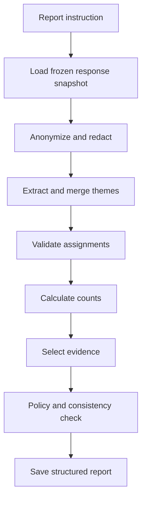
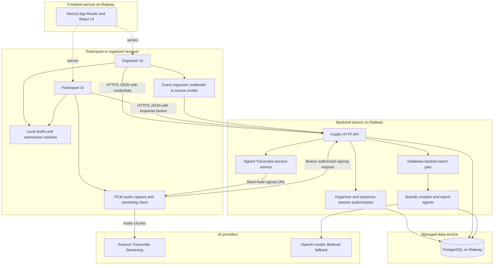

# Saywide — Development Specification

> Hackathon MVP product and technical design.

## 1. Document status

| Field | Value |
|---|---|
| Product | Saywide |
| Version | 1.0 |
| Status | Hackathon MVP specification |
| Target track | Good Neighbor Agents |
| Event | [Agents for Humans Hackathon](https://agentsforhumans.devpost.com/) |
| Primary agent framework | Strands Agents TypeScript SDK (`@strands-agents/sdk`) |
| Intended build period | 3–7 focused development days |

## 2. Product summary

Saywide is a lightweight listening app for schools and community groups. An organizer creates a short open-ended survey, shares a link or QR code, and participants answer by speaking or typing. When collection is complete, the organizer asks for a report in plain language, for example:

> Identify the three most common problems, the three most popular likes, and any suggestions that could be acted on this month.

A Strands agent then loads the responses, removes identifying details, discovers and consolidates themes, counts support, retrieves evidence, validates the result, and creates a readable report.

**One-line pitch:** Create a survey by talking. Answer by talking. Understand everyone with AI.

**Hackathon positioning:** An AI listening agent that helps schools and community groups turn many private voices into transparent, evidence-backed action.

## 3. Problem

Open-ended feedback is valuable but expensive to collect and analyze:

- Form builders require effort and often favor rigid multiple-choice questions.
- Typing can exclude younger users, people with disabilities, and people who are more comfortable speaking.
- Reading dozens of free-form responses is slow.
- Generic AI summaries can hide minority concerns, invent conclusions, or provide no evidence.
- Enterprise research products are often too complex for a teacher, club organizer, or volunteer.

The product should make the complete feedback loop possible for a non-technical organizer in minutes.

## 4. Goals and non-goals

### 4.1 MVP goals

1. Let an organizer create and publish a survey without registering or logging in.
2. Let a guest organizer return from the same browser to manage every survey created in that guest workspace.
3. Let participants respond by voice or text from a mobile browser without creating an account.
4. Let a guest organizer optionally create an email/password account without losing existing surveys.
5. Let participants review and edit transcripts before submission.
6. Generate a report from a natural-language instruction.
7. Show themes, response counts, and anonymized supporting evidence.
8. Make the agent workflow observable enough for a hackathon demonstration.
9. Protect participants by minimizing stored personal and audio data.

### 4.2 Non-goals for the hackathon

- Complex conditional or branching surveys
- A general-purpose form builder
- Multiple-choice matrix questions
- Participant profiles or social features
- Team permissions and enterprise role management
- Email, SMS, or push campaigns
- External CRM, LMS, or analytics integrations
- Advanced chart builders
- Automated decisions about individuals
- On-device language-model inference
- Production use with real children's data
- PDF export or presentation generation

## 5. Target users and use cases

| User | Need | Example |
|---|---|---|
| Teacher | Hear candid classroom feedback | What helps or prevents students from learning? |
| School leader | Understand shared concerns | What should the school improve next term? |
| Parent association | Prioritize community ideas | Which events or services would families value? |
| Nonprofit | Collect beneficiary feedback | What is working and what support is missing? |
| Local club | Make an inclusive group decision | What activities should the club organize? |
| Volunteer organizer | Review an event | What went well and what should change next time? |

The first demo should use a synthetic classroom scenario because it is easy to understand and avoids collecting real children's data.

## 6. Core user stories

### Organizer

- As a first-time organizer, I can start creating a survey without seeing a login screen.
- As an organizer, I can describe what I want to learn by speaking or typing.
- As an organizer, I can accept or edit AI-suggested questions.
- As an organizer, I can share a link and QR code.
- As a guest organizer, I can return from the same browser and see all surveys created in my guest workspace.
- As a guest organizer, I can create an email/password account and keep all existing surveys.
- As a registered organizer, I can log in from another device and see all surveys owned by my account.
- As an organizer, I can see how many submissions have arrived without seeing participant identities.
- As an organizer, I can close or reopen response collection.
- As an organizer, I can describe the report I need in natural language.
- As an organizer, I can inspect the evidence behind every reported finding.
- As an organizer, I can regenerate a report with a different instruction without changing the original responses.

### Participant

- As a participant, I can open a survey directly from a link or QR code.
- As a participant, I can answer by recording my voice or entering text.
- As a participant, I can review and correct the transcript before submitting it.
- As a participant, I can understand how my response will be used and that audio is processed only for immediate transcription, not retained.
- As a participant, I can submit without creating an account.

## 7. MVP experience

The complete organizer and participant screen inventory is maintained in [Application Screens](docs/application-screens.md). That document is authoritative for screen names, routes, functional elements, UI states, and transitions.

### 7.1 Create

1. A visitor lands on the marketing homepage at `/` and opens the dashboard from either call to action.
2. The dashboard's `New survey` action opens AI-assisted creation at `/create`; the secondary manual action opens `/surveys/new`.
3. When creation begins, the server creates or restores a browser-bound guest organizer workspace.
4. Organizer enters or records a survey goal.
5. The app transcribes voice input when applicable.
6. A Strands creation agent proposes one or more open-ended questions and a short introduction.
7. Organizer edits the title, introduction, questions, anonymity statement, and collection settings.
8. Organizer publishes the survey.
9. The app displays a participant share link and QR code that contain no organizer credential.
10. The organizer dashboard offers account creation as an optional way to protect and recover the surveys from another device.

Example organizer request:

> I want to know what students like about our class and what makes learning difficult.

Suggested survey:

1. What do you like most about this class?
2. What makes it harder for you to learn?
3. What is one change that would improve the class?

### 7.2 Respond

1. Participant opens the public survey link.
2. The page shows the purpose, number of questions, estimated time, and privacy notice.
3. Participant records or types an answer to each question.
4. Recorded audio is transcribed.
5. Participant reviews and can edit the transcript.
6. Participant submits the response.
7. The browser discards streamed PCM chunks after transcription, and the service stores only the participant-approved final text.
8. A neutral confirmation page appears.

### 7.3 Understand

1. Organizer opens the response dashboard using the browser-held guest credential or a registered account session.
2. Dashboard shows response count and collection status.
3. Organizer enters or records a reporting instruction.
4. The Strands reporting agent performs the analysis workflow.
5. The app streams progress states such as `Preparing`, `Finding themes`, `Checking evidence`, and `Writing report`.
6. The final report shows findings, counts, evidence, caveats, and possible actions.
7. Organizer may ask for another report using the same response set.

## 8. Product principles

1. **Voice is an input method, not the product.** The value is inclusive collection plus trustworthy synthesis.
2. **Evidence before polish.** Every material finding must be linked to supporting response excerpts.
3. **Counts are deterministic.** The model proposes semantic labels; application code calculates counts.
4. **No fake precision.** The report distinguishes number of responses from number of theme mentions.
5. **Minority views remain visible.** A low-frequency but serious concern can be reported separately from popular themes.
6. **Humans decide.** The agent suggests interpretations and actions; organizers approve any next step.
7. **Collect less data.** Avoid participant names and accounts, make organizer registration optional, avoid raw audio retention, and minimize metadata.

## 9. Functional requirements

### 9.1 Organizer access and ownership

- Do not show a registration or login wall before the first survey is created.
- When first-time creation begins, create a guest organizer workspace and issue an opaque, high-entropy guest access credential.
- Treat the guest credential as a bearer secret, never as a public identifier. Store only its hash on the server and never log the raw value.
- Store the guest credential in a host-only `Secure`, `HttpOnly`, `SameSite=Lax` cookie set by the backend API. Browser local storage may contain only non-secret UI metadata, not the raw organizer credential.
- Link every survey created in that browser guest workspace to the same guest `organizer_id`, so the organizer can return and see all of them.
- Require either the valid guest credential or an authenticated account session for every organizer-only page and operation.
- Never accept a raw organizer ID, survey ID, participant link, or QR token as proof of organizer ownership.
- Explain that clearing browser data, using private browsing, or changing browser/device can permanently remove guest access.
- Keep the guest credential valid through the intended survey collection period unless it is revoked, and disclose any expiry before publication.
- Show a persistent but non-blocking “Create an account to protect your surveys” action in the guest dashboard.
- Let a guest register with a unique email address and password. Atomically promote the guest workspace to a registered organizer so its existing surveys remain attached.
- If the email already belongs to an account, require a successful login and explicit claim action before transactionally moving the guest surveys to that account and revoking the guest credential.
- Store passwords only as strong password hashes and use revocable, host-only `Secure`, `HttpOnly`, `SameSite=Lax` account-session cookies set by the backend API after registration or login.
- Let a registered organizer log in from any browser and see every survey owned by that account.
- Rate-limit guest workspace creation, survey publication, transcription sessions, and agent runs independently of browser-side controls.

### 9.2 Survey creation

- Accept a typed or recorded survey goal.
- Generate clear, neutral, open-ended questions.
- Flag leading, compound, or sensitive questions for organizer review.
- Allow manual reordering, editing, addition, and deletion.
- Configure:
  - anonymous participation, fixed on for the MVP;
  - response collection open/closed;
  - one submission per browser as a local, soft limit;
  - expiration date, optional;
  - access code, optional;
  - minimum response count before reporting.
- Generate an unguessable public token and QR code.

### 9.3 Response collection

- Mobile-first web UI.
- Support microphone permission denial gracefully by falling back to text.
- Show recording duration and stop/cancel controls.
- Limit recording duration per answer, initially 2 minutes.
- Use Amazon Transcribe Streaming as the only speech-to-text provider.
- Stream supported audio chunks without creating an S3 input object; use 16 kHz, 16-bit mono PCM as the initial compatibility target.
- If streaming is unavailable, preserve the participant's text draft and keep typed answers fully usable rather than uploading audio to another provider.
- Provide transcript loading, error, edit, retry, and delete states.
- Save draft answers locally during the active session.
- Do not expose other participants' responses.
- Prevent duplicate submission of the same response session.
- After submission, store a marker for that survey in browser local storage and
  use it to block or warn about another submission from the same browser.
- Treat the browser marker only as a convenience and abuse deterrent. Clearing
  browser data, changing browsers or devices, or using private browsing can
  bypass it, so reports must count submissions rather than claim unique people.
- Apply best-effort server-side rate and cost limits independently of the local
  marker. Do not create a persistent participant identity or device fingerprint.

### 9.4 Report generation

- Accept a natural-language report instruction.
- Use only finalized submissions included in the selected snapshot.
- Store the exact instruction, response snapshot, model configuration, and agent-run status.
- Produce structured output before rendering prose.
- Each finding must contain:
  - title;
  - category or polarity;
  - plain-language summary;
  - supporting response count;
  - percentage of eligible responses;
  - anonymized evidence references;
  - confidence/caveat;
  - optional suggested action.
- Detect insufficient evidence and say so.
- Preserve dissenting or unique safety-related concerns in a separate section.
- Reject report instructions that request identification, ranking, diagnosis, punishment, or sensitive inference about participants.

### 9.5 Report presentation

- Executive summary
- Requested findings, in the requested order
- Theme cards with count and percentage
- Expandable evidence excerpts
- Minority or emerging views
- Limitations and missing information
- Suggested follow-up questions or actions
- Copy-to-clipboard and Markdown download

## 10. Report semantics

### 10.1 Counting rules

- `eligible responses`: submitted responses included in the report snapshot.
- `theme support`: distinct eligible responses assigned to a theme at least once.
- Multiple mentions of the same theme in one response count once.
- One response may support multiple themes.
- Percentages use `theme support / eligible responses`.
- Counts are calculated in application code from stored assignments, never copied from model prose.

### 10.2 Evidence rules

- Evidence is an excerpt from a finalized transcript.
- Excerpts are anonymized before presentation.
- The app displays opaque labels such as `Response 07`, not database identifiers.
- A finding with no valid evidence is removed or marked unverified.
- Reports quote only the minimum text needed to support a finding.
- Personally identifying or highly sensitive excerpts are paraphrased or suppressed.

### 10.3 Example output

| Finding | Support | Example evidence | Possible action |
|---|---:|---|---|
| Instructions sometimes move too quickly | 9 of 24 (38%) | “I need a little more time after examples.” | Add a two-minute practice pause. |
| Group activities are popular | 15 of 24 (63%) | “Working in small teams helps me understand.” | Keep one group exercise per lesson. |
| Students want clearer homework expectations | 6 of 24 (25%) | “It helps when the homework steps are written down.” | Publish a short checklist with each task. |

This is illustrative synthetic content only.

## 11. Agent design with Strands

Strands TypeScript is used as the orchestration layer around model reasoning and deterministic application tools. It is not the database, speech recognizer, or model itself. The codebase is a TypeScript monorepo with a Next.js frontend and a separate Fastify backend API, both running on Node.js.

The browser receives only UI code and browser-safe contracts. PostgreSQL access, transcription credentials, model adapters, prompts, and Strands tools remain server-side.

### 11.1 Agents

For the MVP, use two focused agents rather than a large multi-agent system:

1. **Survey Creation Agent** — converts an organizer's goal into neutral draft questions and flags risks.
2. **Report Agent** — plans and executes a multi-step, evidence-backed analysis.

The agents can share the same runtime but should use separate system prompts and tool allowlists.

### 11.2 SDK and runtime

- Frontend framework: Next.js 16 App Router with React 19 and TypeScript.
- Backend framework: Fastify on Node.js 22 or later.
- Agent package: `@strands-agents/sdk`.
- Runtime validation and type inference: Zod.
- Primary model provider: OpenAI through the Strands `OpenAIModel` Responses API adapter; Amazon Bedrock remains a configurable fallback.
- Package manager and workspace: pnpm.
- Agent execution: backend only. OpenAI API keys, AWS credentials, and model access never reach the frontend or browser; the speech client may receive only a short-lived, transcription-only signed stream URL from the API.

Minimal installation:

```bash
pnpm --filter @saywide/backend add @strands-agents/sdk openai zod
```

Minimal typed tool pattern:

```ts
import { Agent, tool } from '@strands-agents/sdk';
import { z } from 'zod';
import { responseRepository } from '../repositories/responses.js';

const loadResponseSnapshot = tool({
  name: 'load_response_snapshot',
  description: 'Load finalized responses for a frozen survey snapshot.',
  inputSchema: z.object({
    surveyId: z.string().uuid(),
    snapshotAt: z.string().datetime(),
  }),
  callback: async ({ surveyId, snapshotAt }) => {
    return responseRepository.loadSnapshot({ surveyId, snapshotAt });
  },
});

export const reportAgent = new Agent({
  systemPrompt: REPORT_AGENT_SYSTEM_PROMPT,
  tools: [loadResponseSnapshot],
});
```

### 11.3 Survey Creation Agent tools

| Tool | Responsibility |
|---|---|
| `draft_survey` | Return structured title, introduction, and question drafts. |
| `review_question_quality` | Flag leading, double-barreled, vague, or overly sensitive wording. |
| `save_survey_draft` | Persist an organizer-approved draft. |

### 11.4 Report Agent tools

| Tool | Responsibility | Implementation type |
|---|---|---|
| `load_response_snapshot` | Load eligible transcripts and stable opaque IDs. | Deterministic |
| `anonymize_responses` | Redact names and identifying details. | Rules + model review |
| `extract_candidate_themes` | Propose themes and response-to-theme assignments. | Model |
| `merge_similar_themes` | Consolidate semantically overlapping themes. | Model |
| `validate_assignments` | Check that each assignment is supported by its source. | Model + rules |
| `calculate_theme_counts` | Count distinct response IDs and percentages. | Deterministic |
| `select_evidence` | Select short supporting excerpts. | Model + rules |
| `check_report_policy` | Detect unsafe or identifying conclusions. | Rules + model |
| `save_report` | Persist structured findings and rendered Markdown. | Deterministic |

### 11.5 Report execution sequence



### 11.6 Model strategy

- Use OpenAI through the backend Strands adapter as the primary hackathon model provider.
- Keep Amazon Bedrock configurable as a fallback while its project-level invocation restriction remains unresolved.
- Do not make a local phone model part of the critical path.
- Use lower temperature for extraction and validation.
- Require Zod-constrained structured output for themes and reports.
- Persist allowlisted workflow-stage events and use report-status polling to drive safe progress updates; add SSE delivery after the vertical slice.
- Record tool names, durations, token usage, and sanitized failure information in `agent_run` and `agent_event` without storing model payloads.

### 11.7 Agent safety boundaries

- Never infer a participant's identity, diagnosis, protected traits, intent, or moral character.
- Never rank individual participants.
- Never expose raw internal database IDs.
- Never invent counts; accept only deterministic tool results.
- Never generate a finding that cannot cite validated evidence.
- Treat survey responses as untrusted input and defend against prompt injection.
- Ignore instructions embedded inside responses that attempt to alter agent behavior.

## 12. System architecture



### 12.1 Suggested stack

| Layer | Recommendation | Reason |
|---|---|---|
| Frontend | Next.js 16 App Router, React 19, TypeScript | Reuses Flownee's proven UI foundation while keeping browser concerns in a dedicated application. |
| Styling | Tailwind CSS 4 and shadcn/ui | Reuses the established component and responsive styling approach while allowing a completely new Saywide interface. |
| Backend | Fastify on Node.js 22 or later | Provides a focused, typed HTTP API without carrying the Next.js rendering layer into the backend. |
| API contract | JSON over HTTPS with browser-safe Zod schemas in `@saywide/contracts` | Makes the frontend/backend boundary explicit and keeps request and response types aligned. |
| API access | `NEXT_PUBLIC_API_BASE_URL`; credentialed requests only where organizer cookies are required | Keeps the frontend independently deployable and makes the backend origin configurable. |
| Organizer access | Browser-bound guest capability with optional email/password account | Removes the first-use login wall while retaining authorization and cross-device account access. |
| Validation | Zod | Shared runtime validation for API contracts and agent tools. |
| Agent runtime | `@strands-agents/sdk` | Type-safe Strands agents, tools, structured output, and streaming. |
| Model | OpenAI Responses API through Strands; Amazon Bedrock fallback | Working hosted inference while keeping the model adapter configurable. |
| Database | Railway-managed PostgreSQL | Authoritative storage for organizers, surveys, anonymous responses, report snapshots, findings, and agent events. |
| Jobs | Lightweight database-backed queue initially | Avoid unnecessary infrastructure in a short build. |
| Speech-to-text | Amazon Transcribe Streaming | Uses one AWS-native real-time transcription path and avoids a second provider integration. |
| Audio handling | Supported PCM chunks streamed directly from browser memory | Avoids server audio uploads, Amazon Transcribe batch jobs, S3 audio objects, and durable audio retention. |
| AWS speech authorization | Server-issued, short-lived SigV4-signed Transcribe stream session | Keeps reusable AWS credentials server-side and scopes browser access to transcription. |
| Testing | Vitest, Testing Library, and ESLint | Carries forward Flownee's fast TypeScript verification workflow. |
| Package manager | pnpm with a committed lockfile | Reuses the established deterministic dependency workflow. |
| Deployment | Separate Railway `frontend` and `backend` services plus managed PostgreSQL | GitHub commits to `main` deploy both applications from the same repository through the existing Railway project. |

The existing Railway web service becomes the `frontend` service for `saywide.com`. A separate `backend` service exposes the API, initially through a Railway domain and ultimately through `api.saywide.com`; Railway PostgreSQL is connected only to that service. Each service uses a workspace-scoped build/start command and watch paths for its folder plus `packages/contracts`. A commit to `main` triggers only the services whose watched files changed.

The browser calls the Fastify API and streams supported audio directly to Amazon Transcribe using a short-lived signed session returned by that API; this path does not create an S3 object or send audio through the backend. If streaming cannot be established, the participant can answer by typing. Amazon Bedrock AgentCore remains optional after the complete vertical slice is stable.

### 12.2 TypeScript boundaries

- `frontend/src/app` owns App Router pages and layouts; it contains no database, provider, or agent implementation.
- `frontend/src/components` owns the new Saywide participant and organizer interface.
- `frontend/src/lib/api` is the only frontend HTTP client boundary and reads its base URL from `NEXT_PUBLIC_API_BASE_URL`.
- `frontend/src/lib/audio` owns adapted Flownee microphone capability utilities plus the new PCM capture and Transcribe event-stream code.
- `backend/src/routes` owns thin Fastify route modules grouped by API capability.
- `backend/src/services`, `backend/src/repositories`, and `backend/src/agents` own business logic, PostgreSQL access, transcription, jobs, and Strands orchestration.
- `packages/contracts` contains only browser-safe Zod request/response schemas and inferred TypeScript types shared by the API and frontend client.
- The frontend never imports files from `backend`; all runtime communication crosses the HTTP API.
- The backend never serves application pages and is the only application allowed to access PostgreSQL or long-lived AWS/model credentials.
- Fastify plugins provide cross-cutting database, cookie, CORS, authorization, and request-context behavior; route modules remain thin.
- Production CORS allows only the exact Saywide frontend origins and credentialed requests; it never combines credentials with a wildcard origin.
- Guest organizer access uses an opaque credential in a host-only `Secure`, `HttpOnly`, `SameSite=Lax` cookie set by the API; the frontend sends it only through credentialed API requests, and browser local storage never contains the raw organizer credential.
- Participant local storage contains only active drafts, a non-secret session reference, and soft submission markers; the raw response-session bearer token remains in memory and finalized answers live in PostgreSQL.
- Database access stays behind typed repositories; Strands tools call services or repositories rather than issuing arbitrary SQL.
- Long-lived AWS credentials, model adapters, agent prompts, and private tools remain server-side. Only short-lived, transcription-scoped signed stream URLs may reach the browser.

## 13. Repository structure

```text
saywide.com/
├── frontend/
│   ├── src/
│   │   ├── app/
│   │   │   ├── (organizer)/      # Organizer pages and dashboard
│   │   │   └── s/[publicToken]/  # Public anonymous survey experience
│   │   ├── components/
│   │   │   ├── organizer/
│   │   │   ├── participant/
│   │   │   └── ui/
│   │   └── lib/
│   │       ├── api/              # Typed HTTP client for the backend API
│   │       └── audio/            # PCM capture and Transcribe streaming
│   ├── public/
│   ├── tests/
│   ├── .env.example
│   ├── next.config.ts
│   ├── package.json
│   └── tsconfig.json
├── backend/
│   ├── src/
│   │   ├── app.ts                # Construct and configure Fastify
│   │   ├── server.ts             # Listen on HOST and PORT
│   │   ├── routes/
│   │   │   ├── auth/
│   │   │   ├── surveys/
│   │   │   ├── public/
│   │   │   ├── transcribe/
│   │   │   ├── reports/
│   │   │   └── health/
│   │   ├── plugins/              # Database, cookies, CORS, auth, request context
│   │   ├── agents/
│   │   │   ├── creation-agent.ts
│   │   │   ├── report-agent.ts
│   │   │   ├── prompts/
│   │   │   ├── tools/
│   │   │   └── policies/
│   │   ├── services/
│   │   ├── repositories/
│   │   ├── jobs/
│   │   └── transcription/
│   ├── migrations/
│   ├── tests/
│   │   ├── fixtures/             # Synthetic response sets
│   │   ├── integration/
│   │   └── evaluation/
│   ├── .env.example
│   ├── package.json
│   └── tsconfig.json
├── packages/
│   └── contracts/                # Browser-safe Zod API schemas and types
│       ├── src/
│       ├── package.json
│       └── tsconfig.json
├── docs/
│   ├── api-endpoints.md
│   ├── application-screens.md
│   ├── architecture.md
│   ├── database-structure.md
│   ├── privacy.md
│   ├── reuse-disclosure.md
│   └── demo-script.md
├── package.json
├── pnpm-lock.yaml
├── pnpm-workspace.yaml
├── LICENSE
└── README.md
```

### 13.1 Flownee reuse boundary

Implementation continues in the existing `landofcash/saywide.com` repository, which was initialized during the hackathon submission period. The repository remains private during early development and must be made public with a visible open-source license before submission.

Reuse from the MIT-licensed Flownee project is intentionally limited to:

- the Next.js, React, TypeScript, Tailwind CSS, shadcn/ui, Vitest, ESLint, and pnpm tooling baseline;
- framework-independent microphone capability detection and recording-state primitives; and
- generic loading, retry, transcript-review, accessibility, and no-audio-retention patterns.

The Saywide visual design, organizer and participant UI, guest organizer and email/password account flows, Amazon Transcribe Streaming capture and signed-session implementation, PostgreSQL schema and repositories, survey and response APIs, anonymous participant session flow, report jobs, Strands agents, prompts, tools, policies, evaluation fixtures, and report presentation are new work for this project.

Do not copy Flownee branding, product copy, task-planning contracts, task-specific IndexedDB schema, or branded visual assets. Preserve required MIT notices and include an exact file-level reuse disclosure in the README and `docs/reuse-disclosure.md` before submission.

## 14. Database structure

The complete PostgreSQL schema is maintained in [Database Structure](docs/database-structure.md). That document is authoritative for table and field definitions, relationships, state constraints, indexes, deletion behavior, and migration ownership.

At a high level, PostgreSQL stores organizer workspaces and credentials, surveys and questions, anonymous response sessions and finalized text answers, report requests and outputs, validated findings and evidence, and privacy-safe agent run events. It stores no participant accounts, raw bearer tokens, raw audio, presigned Amazon Transcribe URLs, or browser submission markers.

## 15. API endpoints

The complete Fastify HTTP contract is maintained in [API Endpoints](docs/api-endpoints.md). That document is authoritative for endpoint paths, authentication modes, request and response shapes, status codes, idempotency, state changes, participant bearer-token handling, and Amazon Transcribe WebSocket authorization.

At a high level, the API supports browser-bound guest organizers, optional email/password accounts, survey lifecycle operations, anonymous response sessions, direct Amazon Transcribe authorization, finalized text submission, and evidence-backed report generation. The frontend accesses all backend behavior through this API and never imports backend services directly.

## 16. Structured report contract

The agent should produce a validated object before the application renders Markdown.

```json
{
  "schema_version": "1.0",
  "instruction": "Identify the three most common problems and likes.",
  "eligible_response_count": 24,
  "findings": [
    {
      "title": "Group activities are popular",
      "category": "like",
      "summary": "Many respondents said small-group work helps them learn.",
      "response_ids": ["r_03", "r_04", "r_08"],
      "evidence": [
        {
          "response_id": "r_03",
          "question_id": "q_01",
          "excerpt": "Working in small teams helps me understand."
        }
      ],
      "confidence": "high",
      "caveat": null,
      "suggested_action": "Keep one group exercise per lesson."
    }
  ],
  "minority_views": [],
  "limitations": ["The survey was voluntary and may not represent the entire class."],
  "follow_up_questions": []
}
```

The backend discards model-provided count fields, validates references, calculates counts itself, applies privacy filtering, and then renders the final report.

## 17. Privacy, safety, and security

### 17.1 Privacy defaults

- Show a short, readable consent notice before recording.
- Ask organizers not to solicit names or sensitive personal data.
- Do not collect participant accounts, email addresses, names, or persistent identifiers.
- Collect an organizer email only when the organizer explicitly creates or uses a registered account.
- Discard PCM capture chunks immediately after streaming transcription; never send raw audio through the backend or write it to durable storage.
- Let the participant edit the transcript before final submission.
- Store only short-lived request metadata needed for abuse and cost controls; do not maintain persistent device fingerprints.
- Provide organizer-controlled retention for finalized response text and reports, plus a survey deletion action; this does not enable audio retention.
- Prevent report generation below a configurable minimum group size; default to two.

### 17.2 Security controls

- TLS for all connections.
- Keep capture audio only in browser memory while it streams to Amazon Transcribe; do not send it through the backend or persist it in PostgreSQL, S3, or other durable object storage.
- Encryption at rest using managed service defaults.
- Organizer authorization on every private resource, using either the hashed guest capability or a registered account session.
- Never authorize organizer access from a raw organizer ID, survey ID, participant URL, or QR token.
- Store passwords only with a strong password-hashing scheme; never encrypt or retain plaintext passwords.
- Rotate session identifiers after registration and login, revoke guest credentials after promotion or claim, and use generic login errors.
- Apply login throttling, guest-creation quotas, CSRF protection, and secure cookie settings.
- Allow credentialed API requests only from an explicit production and development frontend-origin allowlist; never use a wildcard CORS origin with credentials.
- Require the frontend API client to use `credentials: 'include'` for organizer requests, and reject state-changing cookie-authenticated requests whose `Origin` is not allowed.
- Hashed optional survey access codes.
- High-entropy public and participant tokens.
- Put only the non-secret participant `sessionId` in API paths. Send the response-session bearer token in the `Authorization` header and compare it to the stored hash.
- Rate-limit signed-session issuance and enforce the two-minute recording limit in the client.
- Treat the client recording limit as a UX boundary, not a hard security control for a direct AWS stream; configure AWS cost alerts before publishing the demo.
- Issue a presigned Transcribe URL only after session authorization, default its connection window to 60 seconds, and never exceed AWS's 300-second `X-Amz-Expires` limit.
- Return raw response tokens and signed WebSocket URLs with `Cache-Control: no-store`; redact authorization headers and full signed URLs from application, proxy, and analytics logs.
- Secrets only in environment or managed secret storage.
- Grant the signing service only the Amazon Transcribe permissions required to start a stream; Bedrock permissions remain server-only and separate.
- Allow only the selected regional Amazon Transcribe WebSocket endpoint in the participant page Content Security Policy.
- Sanitized logs with no transcripts or raw audio.
- Content Security Policy and standard CSRF/XSS defenses.

### 17.3 Youth and school use

The hackathon demo must use synthetic data. A production school release would require jurisdiction-specific consent, retention, safeguarding, accessibility, and student-data reviews. The app must not claim compliance with FERPA, COPPA, GDPR, or other regimes until that review and implementation are complete.

## 18. Failure and edge cases

| Situation | Expected behavior |
|---|---|
| Microphone permission denied | Explain the issue and keep text input fully usable. |
| Audio stream interrupted | Retain the text draft, discard incomplete audio, offer a fresh Amazon Transcribe stream or typed answer, and avoid duplicate answer creation. |
| Transcription uncertain | Highlight low-confidence text and require participant review. |
| Amazon Transcribe unavailable or unsupported | Preserve the text path, explain how to retry voice input, and keep typed answers fully usable. |
| Participant reloads during an unfinished response | Restore the local text draft, discard the lost in-memory bearer token, create a fresh response session before the next protected API call, and let the abandoned server session expire. |
| Guest organizer returns in the same browser | Restore the guest workspace from its secure cookie and show all surveys owned by it. |
| Guest browser data is cleared or private browsing ends | Explain that guest access cannot be recovered; participant links remain public but do not grant organizer access. |
| Guest credential expires | Remove organizer access, do not silently create ownership for the old surveys, and explain that recovery requires an existing registered account relationship. |
| Guest registers a new email | Atomically promote the guest organizer, preserve every survey, rotate sessions, and revoke the guest credential. |
| Guest enters an email that already exists | Require login, then explicitly claim the guest surveys in one transaction. Do not reveal account existence through unauthenticated error details. |
| Registration or survey-claim transaction fails | Roll back ownership and credential changes so surveys remain accessible through the previous valid owner. |
| Survey closed during response | Allow an already-started short grace period or explain that submission closed. |
| Too few responses | Disable reporting and show the configured minimum. |
| Model/provider failure | Preserve the queued request, show a retryable error, and never lose responses. |
| Invalid evidence reference | Drop the finding during validation and record a safe diagnostic event. |
| Prompt injection inside an answer | Treat it as respondent content and never as an instruction. |
| Duplicate or spam submissions | Use the browser-local submitted marker to warn or block an ordinary repeat, reject replayed or expired response-session tokens, and rate-limit abuse. Incognito mode, cleared storage, and another device can bypass the local marker, so never claim one response per person. Let organizers exclude suspicious submissions only through a transparent action. |
| Sensitive identifying excerpt | Redact, paraphrase, or omit it from the organizer-facing report. |

## 19. Observability

Track enough information to debug the pipeline without logging respondent content:

- Survey creation and publication success rate
- Guest workspace creation, same-browser restoration, account promotion, login, and survey-claim success/failure without logging emails or credentials
- Response starts, Transcribe stream setup failures, transcription failures, retries, typed-path selections, and submissions
- Signed-session issuance success/failure and expiry category without recording bearer tokens, authorization headers, or presigned URL query strings
- Median transcription and report-generation latency
- Agent tool sequence, duration, and success/failure
- Schema-validation and evidence-validation failures
- Model and token usage by run
- Number of findings removed by validation or privacy checks
- Report regeneration count

Expose a developer-only run trace in the demo environment. The public organizer view should show friendly progress, not hidden prompts or sensitive logs.

## 20. Testing strategy

### 20.1 Unit tests

- State transitions and authorization checks
- Guest credential hashing, expiry, revocation, cookie handling, and organizer scoping
- Guest-to-account promotion and existing-account survey-claim transactions
- Password hashing, login throttling, session rotation, and generic authentication errors
- Public token and session scoping
- Browser-local submitted-marker behavior, including cleared-storage and incognito limitations
- Response-session token replay and expiry handling
- Verification that participant bearer tokens never appear in paths, query strings, local storage, or logs
- Verification that raw audio never enters durable storage
- PCM framing, sample-rate configuration, and final-versus-partial transcript handling
- Signed Transcribe session authorization, 60-second default, 300-second maximum, no-store response headers, query redaction, survey/session scoping, and least-privilege policy
- Theme count and percentage calculations
- Duplicate mention handling
- Evidence reference validation
- Finalized-data retention and streamed-capture disposal logic
- Report schema validation
- Redaction rules

### 20.2 Integration tests

- Create, publish, respond, submit, and generate report end to end
- Create and publish a survey without registration, then restore its dashboard in the same browser
- Promote a guest workspace to a new email/password account without losing surveys
- Log into an existing account and explicitly claim current guest surveys
- Verify that cleared guest browser state cannot be recovered and that participant links cannot access organizer resources
- Verify the browser uses a non-secret session ID in API paths and a bearer token in the `Authorization` header for protected participant operations
- Reject transcription-session requests with missing, invalid, expired, submitted, or incorrectly scoped response-session tokens
- Amazon Transcribe stream to transcript preview on target mobile browsers
- Same-browser repeat warning or block after submission
- Anonymous link and QR participation without participant registration
- Closed and expired survey behavior
- Failed model call and retry
- Frozen report snapshot while new responses arrive
- Agent tool allowlist enforcement

### 20.3 Agent evaluation set

Create synthetic datasets for at least these cases:

1. Clear majority likes and dislikes.
2. Synonyms that should merge into one theme.
3. Similar phrases that should remain separate themes.
4. One response mentioning the same theme repeatedly.
5. A serious minority concern.
6. Contradictory responses.
7. Names and identifying details requiring redaction.
8. Prompt-injection text embedded in a response.
9. Too little evidence for the requested number of findings.
10. Responses in more than one language, if multilingual support is demonstrated.

For each fixture, store expected themes, acceptable alternative labels, exact deterministic counts, required evidence coverage, and prohibited conclusions.

## 21. Accessibility

- Complete flow usable without voice.
- Semantic HTML and keyboard access.
- Visible focus states and sufficient contrast.
- Recording state communicated visually and to assistive technology.
- No color-only status indicators.
- Plain-language privacy notice and errors.
- Transcript review supports zoom and mobile text sizing.
- Captions/transcript used for every recorded answer.

## 22. Implementation plan

### Phase 1 — Frontend/backend walking skeleton and anonymous text slice

- Keep the existing `landofcash/saywide.com` repository and working Railway deployment from `main`.
- Convert the repository into a pnpm workspace with `frontend`, `backend`, and `packages/contracts` packages.
- Build `frontend` as a Next.js 16 App Router application using the Flownee-compatible React 19, TypeScript, Tailwind CSS 4, shadcn/ui, Vitest, and ESLint baseline.
- Build `backend` as a Fastify TypeScript API with thin schema-validated routes, plugins, services, and repositories.
- Configure separate Railway `frontend` and `backend` services from the same repository; keep `saywide.com` on the frontend and configure the frontend with the backend API origin.
- Provision Railway PostgreSQL for the backend, add migrations, and implement organizers, hashed guest credentials, surveys, questions, response sessions, and answers.
- Connect the frontend to the backend exclusively through the typed HTTP API client.
- Create or restore a guest organizer workspace through a secure browser cookie without showing a login screen.
- Let the guest organizer create one text question, publish it, and copy both a public link and QR code.
- Let the guest organizer leave, return in the same browser, and reopen the survey dashboard.
- Let a participant open the public capability link without registering, submit a text answer, and receive a browser-local submitted marker.
- Show the organizer the response count.
- Add the README, environment template, license, and initial reuse-disclosure document.

**Exit condition:** without registering, an organizer can create and publish a survey, return from the same browser, and complete the frontend → Fastify API → PostgreSQL path for link/QR sharing, text answers, and the organizer response count.

### Phase 2 — Strands report vertical slice

- Install and configure `@strands-agents/sdk` in the Fastify backend package.
- Implement the smallest useful report workflow: load a frozen text-response snapshot, extract themes, calculate deterministic counts, validate evidence references, and save a structured report.
- Define Zod-typed Strands tools and structured outputs for that path.
- Add a natural-language report request, a minimal report page, and safe progress events.
- Validate the workflow against a small synthetic fixture before adding voice.

**Exit condition:** the deployed text-response path produces a traceable Strands report with reproducible counts and validated evidence.

### Phase 3 — AWS-native voice path

- Define the Amazon Transcribe streaming contract for normalized partial/final text and safe diagnostics.
- Run a time-boxed compatibility spike using 16 kHz, 16-bit mono PCM and Amazon Transcribe Streaming on the target mobile browsers.
- Adapt the Flownee microphone capability and recording-state primitives into `frontend/src/lib/audio`.
- Build new PCM capture and Amazon Transcribe event-stream handling for Saywide.
- Add a thin Fastify route that accepts a non-secret session ID plus an `Authorization` bearer token, validates the anonymous response session, rate-limits issuance, and returns a no-store SigV4-presigned Transcribe WebSocket URL with a 60-second default connection window and the client recording limit.
- Scope the Railway AWS identity to the minimum Transcribe streaming permissions; keep Bedrock permissions separate and server-only.
- Build a new Saywide recording, live-transcript, review/edit, retry, and local-draft experience.
- Keep capture chunks in browser memory only; do not add a backend audio-upload endpoint, Amazon Transcribe batch jobs, or S3 audio objects in the MVP.
- Keep typed answers available whenever microphone access or Amazon Transcribe Streaming is unavailable.
- Feed finalized transcripts through the response and report path proven in Phase 2.

**Exit condition:** the normal mobile demo path transcribes through Amazon Transcribe Streaming, the typed recovery path is verified, and only the participant-approved final transcript is stored in PostgreSQL.

### Phase 4 — Creation agent and product polish

- Add goal-to-survey generation and question-quality review.
- Add email/password registration, login, logout, guest-to-account promotion, and existing-account survey claiming.
- Add the guest-access recovery warning and non-blocking account-upgrade action.
- Polish sharing, QR display, empty states, loading states, and mobile behavior.
- Complete abuse controls, privacy copy, accessibility, and error recovery.

**Exit condition:** a new organizer can finish the complete flow without guidance.

### Phase 5 — Submission assets

- Make the repository public before submission and verify the selected open-source license.
- Add a public deployment and clearly labeled synthetic demo dataset.
- Complete the architecture diagram and technical README.
- Document every reused Flownee file or adapted module and preserve applicable MIT notices.
- Capture agent trace screenshots or a demo view.
- Record the five-minute demo video.
- Clearly disclose libraries, models, reused assets, and limitations.

## 23. MVP acceptance criteria

The MVP is ready for judging when all of the following are true:

- [ ] A new survey can be created from a typed or spoken goal.
- [ ] A first-time organizer can create and publish a survey without registration or login.
- [ ] Returning in the same browser restores access to every survey in the guest organizer workspace.
- [ ] Clearing browser data removes access for an unregistered guest, and this limitation is explained before the organizer relies on it.
- [ ] A participant link, QR token, raw organizer ID, or survey ID cannot authorize organizer-only access.
- [ ] A guest can create an email/password account without losing any survey.
- [ ] A registered organizer can log in from another browser and see all surveys owned by the account.
- [ ] After login to an existing account, the organizer can explicitly claim the current guest surveys without partial ownership changes.
- [ ] The organizer can edit and publish one or more questions without a product-level question-count limit.
- [ ] A public link and QR code open on a phone.
- [ ] A participant can answer entirely by text.
- [ ] A participant can record, review, edit, and submit a transcript.
- [ ] The normal mobile demo path uses Amazon Transcribe Streaming.
- [ ] Participant bearer tokens never appear in URLs; protected participant API calls use a non-secret session ID plus the `Authorization` header.
- [ ] Amazon Transcribe WebSocket URLs are issued only after Saywide session authorization, expire for new connections within 60 seconds by default and never more than 300 seconds, and are never cached, persisted, or logged.
- [ ] If voice transcription is unavailable, the participant can continue with a typed answer without losing the active draft.
- [ ] The MVP does not create Amazon Transcribe batch jobs or S3 audio objects.
- [ ] No participant account, sign-in, email address, or profile is required.
- [ ] A successful submission writes a soft per-survey marker to browser local storage and a same-browser repeat is blocked or warned.
- [ ] The product explains that private browsing, cleared storage, and another device can bypass this marker, so it never claims one response per person.
- [ ] Finalized anonymous answers are stored in PostgreSQL; only drafts, a non-secret active session reference, and soft submission markers are stored locally.
- [ ] Raw audio is never written to PostgreSQL, object storage, or another durable store.
- [ ] The organizer can close collection.
- [ ] A report instruction launches a real Strands tool workflow.
- [ ] The final report contains deterministic counts.
- [ ] Every material finding has validated, anonymized evidence.
- [ ] The app refuses or caveats unsupported conclusions.
- [ ] Responses containing prompt injection do not alter agent behavior.
- [ ] The deployed demo works with synthetic response data.
- [ ] The repository includes setup steps, architecture, license, limitations, and an exact Flownee reuse disclosure.

## 24. Hackathon demo narrative

Keep the demo focused on one understandable story:

1. A teacher opens Saywide and starts immediately without registering or logging in.
2. The teacher says, “I want to know what students like about class and what makes learning difficult.”
3. The creation agent suggests three neutral questions.
4. The teacher publishes and displays the QR code.
5. A student opens the link on a phone, records an answer, corrects one transcription word, and submits anonymously.
6. The dashboard switches to a prepared synthetic set of roughly 20–30 responses.
7. The teacher asks for the top three problems, top three likes, and practical actions.
8. The UI shows the Strands tools executing.
9. The report appears with counts and expandable evidence.
10. The teacher opens one finding and verifies where it came from.
11. The demo closes with the same-browser guest recovery limitation, optional account protection, privacy defaults, and broader community use cases.

Avoid spending demo time on authentication, settings, or charts. The memorable moment is the transition from many voices to a transparent, useful report.

## 25. Hackathon submission checklist

- [ ] The Saywide-specific application and material Strands agent workflow were built during the eligible event window, with all adapted Flownee modules disclosed.
- [ ] Strands Agents SDK is used materially, not only imported.
- [ ] Repository is public and uses an allowed open-source license.
- [ ] README explains local setup, deployment, architecture, model, and Strands tools.
- [ ] Architecture diagram is included.
- [ ] Public demo or reliable recorded fallback is available.
- [ ] Video is public, within the event limit, and shows the working agent.
- [ ] Synthetic demo data is clearly identified.
- [ ] Third-party libraries, APIs, assets, and any reused code are disclosed.
- [ ] AWS/Strands configuration contains no committed secrets.
- [ ] Submission describes human benefit, agent behavior, privacy, and limitations.
- [ ] Final event rules and deadlines are rechecked before submission.

## 26. Roadmap after the MVP

1. Follow-up surveys generated from unresolved themes.
2. Organizer-approved action plans and progress check-ins.
3. Multilingual collection and cross-language theme analysis.
4. Accessibility-focused spoken survey navigation.
5. Longitudinal comparison across recurring surveys.
6. Export to Markdown, CSV, or presentation formats.
7. School/community templates with reviewed privacy language.
8. Optional on-device transcription or small-model processing when device support and privacy benefits justify the complexity.

## 27. Implementation defaults

These defaults are settled for the MVP unless implementation evidence forces a change.

| Decision | MVP default |
|---|---|
| Product name | Saywide. |
| Application architecture | TypeScript monorepo with separate `frontend` and `backend` applications communicating only through an HTTP API. |
| Frontend baseline | Match the Flownee stack: React 19, TypeScript, Tailwind CSS 4, shadcn/ui, pnpm, Vitest, and ESLint; build a new Saywide interface. |
| Frontend framework | Next.js 16 App Router deployed as the Railway `frontend` service for `saywide.com`. |
| Backend framework | Fastify on Node.js 22 or later, deployed as a separate Railway `backend` service. |
| API boundary | JSON over HTTPS using browser-safe schemas from `@saywide/contracts`; the frontend never imports backend source or accesses PostgreSQL directly. |
| Database | Railway-managed PostgreSQL with migrations and server-only repositories. |
| Participant identity | None. Public capability link plus short-lived anonymous response-session token; no registration, email, login, or profile. |
| Participant API authorization | Non-secret `sessionId` in the path plus a short-lived bearer token in the `Authorization` header; store only the token hash server-side and keep the raw token in browser memory. |
| Duplicate deterrence | Soft per-survey browser local-storage marker, session replay protection, and server rate/cost limits; accept incognito, cleared-storage, and other-device bypass. |
| Organizer first use | Guest organizer workspace with no registration or login wall. |
| Guest persistence | Opaque browser credential in a host-only `Secure`, `HttpOnly`, `SameSite=Lax` API cookie; only its hash is stored server-side. |
| Organizer account | Optional unique email/password account with secure password hashing and revocable account sessions. |
| Guest upgrade | Promote a guest to a new account without changing survey ownership; require login and an explicit atomic claim when merging into an existing account. |
| Speech provider | Amazon Transcribe Streaming only; typed text is the recovery path when voice is unavailable. |
| AWS stream authorization | Backend-generated SigV4-presigned WebSocket URL after Saywide session authorization; 60-second default connection window, 300-second hard maximum, and `Cache-Control: no-store`. |
| Streaming audio target | 16 kHz, 16-bit mono PCM initially; verify capture and event-stream behavior on target mobile browsers before locking the implementation. |
| Raw audio retention | None. Stream from browser memory and discard capture buffers; backend audio uploads, Amazon Transcribe batch jobs, and S3 audio objects are excluded from the MVP. |
| Minimum report group size | Two submitted responses. |
| Languages | One primary language in the MVP; preserve UTF-8 for future expansion. |
| Report delivery | In-app page plus Markdown download. |
| Deployment | Separate Railway `frontend` and `backend` services plus managed PostgreSQL in the existing project; commits to `main` deploy through service watch paths. |
| Agent deployment | Run Strands only in the Fastify backend service; consider Amazon Bedrock AgentCore only after the full vertical slice is stable. |
| Charts | Omit unless time remains after accuracy, evidence, and privacy work. |

## 28. Technical references

- [Amazon Transcribe streaming over HTTP/2 or WebSockets](https://docs.aws.amazon.com/transcribe/latest/dg/getting-started-http-websocket.html)
- [Amazon Transcribe streaming setup](https://docs.aws.amazon.com/transcribe/latest/dg/streaming-setting-up.html)
- [Next.js App Router](https://nextjs.org/docs/app)
- [Next.js self-hosting](https://nextjs.org/docs/app/guides/self-hosting)
- [Fastify TypeScript](https://fastify.dev/docs/latest/Reference/TypeScript/)
- [Fastify validation and serialization](https://fastify.dev/docs/latest/Reference/Validation-and-Serialization/)
- [Strands Agents TypeScript 1.0 announcement](https://strandsagents.com/blog/strands-agents-typescript-v1/)
- [Current Strands SDK monorepo](https://github.com/strands-agents/harness-sdk)
- [Strands TypeScript package](https://www.npmjs.com/package/@strands-agents/sdk)

## 29. Definition of success

The project succeeds if a judge can create a survey without logging in, answer it by voice on a phone, and watch a Strands agent turn a realistic response set into a report whose claims can be checked against anonymized evidence. The demo should feel useful to a real teacher or community organizer, while remaining small enough to understand and trust.
