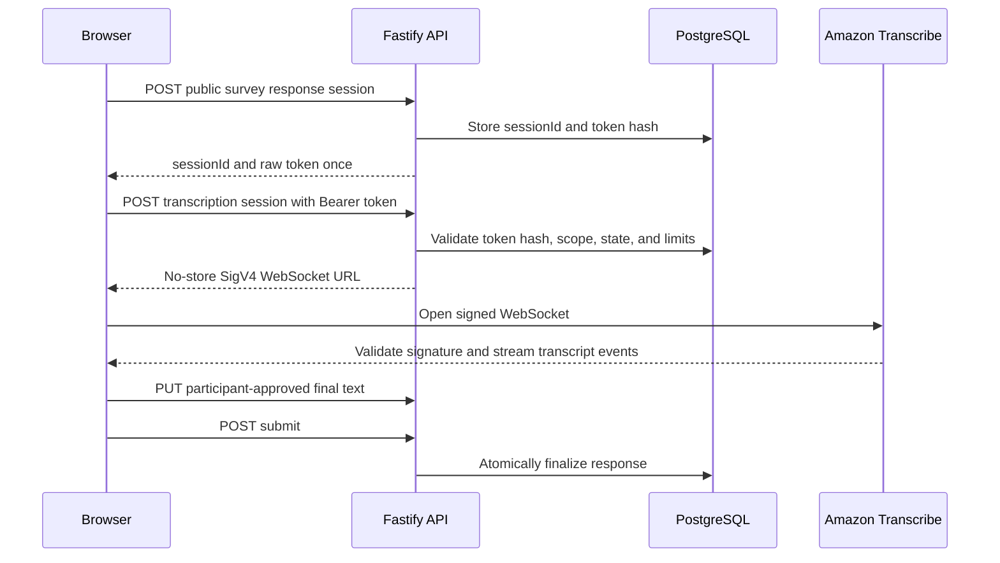

# Saywide — API Endpoints

> Authoritative HTTP API contract for the Saywide MVP.

## 1. Scope

This document defines the Fastify backend endpoints used by the Saywide frontend. It is the API companion to the [development specification](../development-spec.md) and [database structure](database-structure.md).

### 1.1 Implementation status

The current backend implements health, guest-session creation and
restoration, manual survey creation/read/update/publish/close/reopen/summary,
public survey reads, anonymous response sessions, text answer upserts, and
submission. The minimal direct browser-to-Amazon Transcribe authorization route
is also implemented. Report list, request, and polling routes run the bounded
Strands report workflow and persist privacy-safe progress records. The SSE event
route remains a target contract; the current frontend polls report status.
Account and survey-generation agent routes remain unimplemented.

The production API origin is intended to be `https://api.saywide.com`. Paths below are relative to that origin. The public participant page remains on the frontend at `https://saywide.com/s/{publicToken}` and loads its data from this API.

## 2. API conventions

### 2.1 Transport and representation

- All traffic uses HTTPS in production.
- JSON request and response bodies use UTF-8 and `Content-Type: application/json`.
- Timestamps use ISO 8601 UTC strings.
- IDs in paths are opaque identifiers. Possession of an ID never grants organizer access.
- Successful list responses return an object containing an `items` array so pagination can be added without changing the top-level shape.
- Endpoints returning raw bearer tokens or presigned URLs include `Cache-Control: no-store`.
- The backend never accepts raw audio. The browser streams audio directly to Amazon Transcribe and submits only participant-approved text.
- The MVP paths are unversioned under `/api`; incompatible changes require either coordinated frontend deployment or a future versioned prefix.

### 2.2 Authentication modes

| Mode | Used by | Mechanism |
|---|---|---|
| Public | Survey metadata and response-session creation | No account session. The public survey token identifies the survey but never authorizes organizer access. |
| Guest organizer | Browser-bound organizer workspace | Host-only `Secure`, `HttpOnly`, `SameSite=Lax` guest cookie set by the API. |
| Registered organizer | Email/password organizer account | Host-only `Secure`, `HttpOnly`, `SameSite=Lax` account-session cookie set by the API. |
| Guest claim | Transfer into an existing account | Both a valid guest cookie and a valid registered account-session cookie. |
| Anonymous response session | Draft answers, transcription authorization, and submission | Non-secret `sessionId` in the path plus `Authorization: Bearer <response-session-token>`. |

The frontend uses `credentials: 'include'` for organizer requests. Production CORS permits credentials only from the exact Saywide frontend origins. Cookie-authenticated state-changing requests also require an allowed `Origin`.

The raw response-session token is returned once and held in browser memory only. It never appears in a URL, local storage, logs, analytics, or error messages. The backend stores only its hash.

### 2.3 Standard error shape

Non-success responses use this shape:

```json
{
  "error": {
    "code": "VALIDATION_ERROR",
    "message": "The request could not be processed.",
    "requestId": "opaque-request-reference",
    "fields": {
      "title": "Required"
    }
  }
}
```

- `code` is a stable machine-readable category.
- `message` is safe for display and never reveals credentials, account existence, internal IDs, prompts, provider payloads, or database details.
- `requestId` correlates sanitized server logs.
- `fields` is optional and contains only safe validation details.

Common status codes:

| Status | Meaning |
|---:|---|
| `400` | Malformed JSON, invalid parameters, or invalid state transition. |
| `401` | Required organizer or response-session authentication is missing or invalid. |
| `403` | The authenticated caller is valid but the operation is not allowed. Prefer `404` for organizer-owned resources to avoid exposing their existence. |
| `404` | Resource not found, not owned by the organizer, or unavailable through the supplied public token. |
| `409` | State conflict, duplicate operation, or account transition requiring another flow. |
| `422` | Structurally valid request that violates survey or submission rules. |
| `429` | Rate, abuse, or cost limit exceeded. |
| `503` | Required provider or database dependency is temporarily unavailable. |

### 2.4 Idempotency and retries

- State-transition endpoints return the current successful result when repeating the same completed transition is safe.
- `POST /api/public/s/{publicToken}/sessions`, `POST /api/surveys`, and `POST /api/surveys/{surveyId}/reports` accept an optional `Idempotency-Key` header for retry protection.
- An idempotency key is scoped to the authenticated organizer or public survey context and expires after a bounded period.
- Reusing a key with a different request body returns `409 IDEMPOTENCY_KEY_REUSED`.
- `PUT` answer updates are naturally idempotent for a response session and question.

## 3. Endpoint summary

| Method | Path | Access | Description |
|---|---|---|---|
| `GET` | `/api/health` | Public | Report backend readiness without exposing configuration. |
| `POST` | `/api/organizer/guest-session` | Public/guest cookie | Create or restore a browser-bound guest workspace. |
| `GET` | `/api/organizer/surveys` | Organizer | List surveys owned by the current workspace or account. |
| `POST` | `/api/auth/register` | Guest organizer | Promote the current guest workspace to a new account. |
| `POST` | `/api/auth/login` | Public | Create a registered organizer session. |
| `POST` | `/api/auth/claim-guest` | Guest and account cookies | Transfer the guest workspace into the signed-in account. |
| `POST` | `/api/auth/logout` | Account session | Revoke the current registered account session. |
| `POST` | `/api/surveys/draft-from-goal` | Organizer | Generate and persist an editable survey draft from a goal. |
| `POST` | `/api/surveys` | Organizer | Create a manual survey draft. |
| `GET` | `/api/surveys/{surveyId}` | Organizer/owner | Load an editable survey and its questions. |
| `PATCH` | `/api/surveys/{surveyId}` | Organizer/owner | Update survey content or collection settings. |
| `POST` | `/api/surveys/{surveyId}/publish` | Organizer/owner | Validate and open a survey for responses. |
| `POST` | `/api/surveys/{surveyId}/close` | Organizer/owner | Stop new response sessions. |
| `POST` | `/api/surveys/{surveyId}/reopen` | Organizer/owner | Reopen an eligible closed survey. |
| `GET` | `/api/surveys/{surveyId}/summary` | Organizer/owner | Load collection status and aggregate counts. |
| `GET` | `/api/surveys/{surveyId}/reports` | Organizer/owner | List current and previous report requests for the survey. |
| `POST` | `/api/surveys/{surveyId}/reports` | Organizer/owner | Queue an evidence-backed report request. |
| `GET` | `/api/reports/{reportId}` | Organizer/owner | Load report progress or the completed result. |
| `GET` | `/api/reports/{reportId}/events` | Organizer/owner | Stream privacy-safe report progress events. |
| `GET` | `/api/public/s/{publicToken}` | Public | Load participant-safe survey metadata and questions. |
| `POST` | `/api/public/s/{publicToken}/sessions` | Public | Start an anonymous response session. |
| `POST` | `/api/public/sessions/{sessionId}/transcription-sessions` | Response bearer | Issue a short-lived Amazon Transcribe WebSocket URL. |
| `PUT` | `/api/public/sessions/{sessionId}/answers/{questionId}` | Response bearer | Create or update one draft text answer. |
| `POST` | `/api/public/sessions/{sessionId}/submit` | Response bearer | Validate and finalize the anonymous response. |

## 4. Operational endpoint

### `GET /api/health`

Returns backend readiness for Railway health checks.

- **Authentication:** None.
- **Request:** No body.
- **Success:** `200` with `{ "status": "ok" }` when the process can serve requests and reach PostgreSQL.
- **Failure:** `503` with `{ "status": "unavailable" }` when a required dependency is unavailable.
- **Rules:** Do not expose versions, environment values, database addresses, AWS account information, or stack traces.

## 5. Organizer access and account endpoints

### `POST /api/organizer/guest-session`

Creates the first browser-bound guest organizer workspace or restores the workspace represented by an existing valid guest cookie.

- **Authentication:** Existing guest cookie is optional. A valid account session takes precedence and prevents accidental creation of another guest workspace.
- **Request:** No body.
- **Success:** `201` when created or `200` when restored. Returns `{ workspace: { kind, recoveryRisk, createdAt } }` and sets or refreshes the guest cookie.
- **State changes:** Inserts `organizer` and `organizer_credential` records only when no valid organizer context exists.
- **Failures:** `429 GUEST_CREATION_LIMITED` or `503 DEPENDENCY_UNAVAILABLE`.
- **Rules:** The response never exposes the raw organizer ID or credential. The operation is idempotent for a valid guest cookie.

### `GET /api/organizer/surveys`

Lists all surveys owned by the current guest workspace or registered account.

- **Authentication:** Valid guest or account-session cookie.
- **Query:** Optional `status`, `cursor`, and bounded `limit` filters.
- **Success:** `200` with `{ items: SurveySummary[], nextCursor: string | null }`.
- **Survey summary:** Contains `surveyId`, title, status, question count, submitted response count, expiry, creation time, and update time.
- **Failures:** `401 ORGANIZER_AUTH_REQUIRED` or `400 VALIDATION_ERROR`.
- **Rules:** Every query is scoped by the authorized `organizer_id`; another organizer's survey is never returned.

### `POST /api/auth/register`

Promotes the current guest workspace to a registered email/password organizer without changing survey ownership.

- **Authentication:** Valid active guest cookie.
- **Request:** `{ email, password }`.
- **Success:** `201` with `{ workspace: { kind: "registered" } }`; atomically updates the organizer, revokes the guest credential, rotates session state, sets an account-session cookie, and clears the guest cookie.
- **Failures:** `400 VALIDATION_ERROR`, `401 GUEST_AUTH_REQUIRED`, `409 REGISTRATION_REQUIRES_SIGN_IN`, or `429 AUTH_RATE_LIMITED`.
- **Rules:** Normalize the email before uniqueness checks and store only a strong password hash. Do not reveal whether a submitted email already belongs to an account; direct the organizer to the login-and-claim flow using generic wording.

### `POST /api/auth/login`

Authenticates an existing registered organizer and creates a revocable account session.

- **Authentication:** None required. An existing guest cookie is preserved until the organizer explicitly claims or discards that workspace.
- **Request:** `{ email, password }`.
- **Success:** `200` with `{ workspace: { kind: "registered" }, guestWorkspacePending: boolean }` and a rotated account-session cookie.
- **Failures:** `401 INVALID_CREDENTIALS` with a generic message or `429 AUTH_RATE_LIMITED`.
- **Rules:** Normalize the email, use constant-behavior credential handling where practical, and never disclose whether the email or password was incorrect.

### `POST /api/auth/claim-guest`

Transfers every survey from the current guest workspace into the signed-in registered account.

- **Authentication:** Both a valid guest cookie and a valid account-session cookie.
- **Request:** `{ confirm: true }` to make the ownership transfer explicit.
- **Success:** `200` with `{ transferredSurveyCount }`; atomically transfers surveys, marks the guest organizer as merged, revokes its credentials, and clears the guest cookie.
- **Failures:** `401 AUTH_REQUIRED`, `409 CLAIM_NOT_AVAILABLE`, or `422 CONFIRMATION_REQUIRED`.
- **Rules:** The transfer, merge state, credential revocation, and audit state commit in one transaction or roll back together.

### `POST /api/auth/logout`

Ends the current registered organizer session.

- **Authentication:** Account-session cookie.
- **Request:** No body.
- **Success:** `204` with no response body; revokes the current session and clears its cookie.
- **Failures:** Repeating logout after the session is gone still returns `204`.
- **Rules:** Logout does not delete surveys or the organizer account.

## 6. Organizer survey endpoints

### `POST /api/surveys/draft-from-goal`

Uses the Survey Creation Agent to generate and persist an editable draft from the organizer's stated goal.

- **Authentication:** Valid guest or account-session cookie.
- **Request:** `{ goal, inputMode }`, where `inputMode` is `text` or `voice`; voice input is already approved transcript text when it reaches this endpoint.
- **Success:** `201` with a complete `SurveyDetail` containing `surveyId`, title, introduction, suggested questions, warnings, settings, and `status: "draft"`.
- **State changes:** Creates the draft survey before the agent run so the run and events can be scoped to `survey_id`.
- **Failures:** `400 VALIDATION_ERROR`, `401 ORGANIZER_AUTH_REQUIRED`, `429 AGENT_LIMITED`, or `503 AGENT_UNAVAILABLE`.
- **Rules:** The agent may suggest only one or more questions. The organizer must be able to edit every generated field before publishing.

### `POST /api/surveys`

Creates a survey draft without invoking the creation agent.

- **Authentication:** Valid guest or account-session cookie.
- **Request:** `{ title, introduction, questions, settings }`. Questions contain `{ prompt, required }`; settings contain optional expiry, access-code, and minimum-report threshold values.
- **Success:** `201` with the persisted `SurveyDetail`.
- **Failures:** `400 VALIDATION_ERROR`, `401 ORGANIZER_AUTH_REQUIRED`, `422 SURVEY_RULE_VIOLATION`, or `429 SURVEY_CREATION_LIMITED`.
- **Rules:** Accept one or more ordered questions. Hash an access code when supplied and never return it after creation.

### `GET /api/surveys/{surveyId}`

Loads the organizer's full survey draft or published configuration for editing and administration.

- **Authentication:** Valid guest or account-session cookie belonging to the survey owner.
- **Request:** No body.
- **Success:** `200` with `SurveyDetail`, including ordered questions, editable settings, status, participant share URL when published, and non-sensitive collection metadata.
- **Failures:** `401 ORGANIZER_AUTH_REQUIRED` or `404 SURVEY_NOT_FOUND`.
- **Rules:** Never return access-code hashes, credentials, internal report prompts, or participant answer text through this endpoint.

### `PATCH /api/surveys/{surveyId}`

Updates editable survey content or collection settings.

- **Authentication:** Valid owner guest or account-session cookie.
- **Request:** Partial `{ title, introduction, questions, settings }` with at least one supplied field.
- **Success:** `200` with the updated `SurveyDetail`.
- **Failures:** `400 VALIDATION_ERROR`, `404 SURVEY_NOT_FOUND`, or `409 SURVEY_NOT_EDITABLE`.
- **Rules:** Question identity and wording become immutable once submitted responses exist. Collection settings may change only when the transition preserves existing response and credential guarantees.

### `POST /api/surveys/{surveyId}/publish`

Validates a draft, creates its participant capability token when needed, and opens response collection.

- **Authentication:** Valid owner guest or account-session cookie.
- **Request:** No body.
- **Success:** `200` with `{ surveyId, status: "open", shareUrl, publicToken, expiresAt }`.
- **Failures:** `404 SURVEY_NOT_FOUND`, `409 INVALID_SURVEY_STATE`, or `422 SURVEY_NOT_PUBLISHABLE` with safe field details.
- **Rules:** Require one or more valid questions and ensure the guest organizer credential remains valid through the configured collection period. Repeating publish on the same open survey returns the same public token and link.

### `POST /api/surveys/{surveyId}/close`

Stops creation of new response sessions while preserving submitted answers and reports.

- **Authentication:** Valid owner guest or account-session cookie.
- **Request:** No body.
- **Success:** `200` with `{ surveyId, status: "closed" }`.
- **Failures:** `404 SURVEY_NOT_FOUND` or `409 INVALID_SURVEY_STATE`.
- **Rules:** Repeating close on a closed survey is idempotent. A short, explicitly configured grace period may permit completion of sessions started before closure.

### `POST /api/surveys/{surveyId}/reopen`

Reopens response collection for a closed survey.

- **Authentication:** Valid owner guest or account-session cookie.
- **Request:** Optional `{ expiresAt }` to extend a previous expiry.
- **Success:** `200` with `{ surveyId, status: "open", shareUrl, expiresAt }`.
- **Failures:** `404 SURVEY_NOT_FOUND`, `409 INVALID_SURVEY_STATE`, or `422 SURVEY_EXPIRED`.
- **Rules:** Archived surveys cannot be reopened in the MVP. Reopening preserves the existing public token and previously submitted responses.

### `GET /api/surveys/{surveyId}/summary`

Returns collection status and aggregate counts for the organizer dashboard without returning answer content.

- **Authentication:** Valid owner guest or account-session cookie.
- **Request:** No body.
- **Success:** `200` with `{ surveyId, status, startedResponseCount, submittedResponseCount, reportEligible, minReportResponses, expiresAt, lastSubmittedAt }`.
- **Failures:** `404 SURVEY_NOT_FOUND`.
- **Rules:** Counts refer to response sessions or submissions, never verified unique people.

## 7. Organizer report endpoints

### `GET /api/surveys/{surveyId}/reports`

Lists current and previous report requests for the organizer's survey.

- **Authentication:** Valid guest or account-session cookie belonging to the survey owner.
- **Query:** Optional `cursor`, bounded `limit`, and `status` filters.
- **Success:** `200` with `{ items: ReportSummary[], nextCursor }`. Each summary contains `reportId` when completed, `reportRequestId`, a shortened instruction, status, snapshot time, eligible-response count when known, creation time, and completion time.
- **Failures:** `404 SURVEY_NOT_FOUND` or `400 VALIDATION_ERROR`.
- **Rules:** Results are ordered newest first and never expose prompts, answer text, provider payloads, or another organizer's reports.

### `POST /api/surveys/{surveyId}/reports`

Freezes the eligible response snapshot and queues a Strands report run for the organizer's instruction.

- **Authentication:** Valid owner guest or account-session cookie.
- **Request:** `{ instruction }`.
- **Success:** `202` with `{ reportId, reportRequestId, status: "queued", snapshotAt }`.
- **Failures:** `404 SURVEY_NOT_FOUND`, `409 REPORT_ALREADY_RUNNING`, `422 TOO_FEW_RESPONSES`, `422 REPORT_RESPONSE_LIMIT_EXCEEDED`, `429 AGENT_LIMITED`, or `503 AGENT_UNAVAILABLE`.
- **Rules:** `snapshotAt` is fixed when accepted. Later submissions do not change this report. The endpoint never accepts organizer-provided counts or evidence IDs.
- **Current bounded slice:** snapshots over `REPORT_MAX_RESPONSES` (30 by default) are rejected until a batching workflow is implemented.

### `GET /api/reports/{reportId}`

Returns report progress or the completed validated report.

- **Authentication:** Valid guest or account-session cookie belonging to the report's survey owner.
- **Request:** No body.
- **Success while running:** `200` with `{ reportId, status, snapshotAt, progress }`.
- **Success when complete:** `200` with `{ reportId, status: "completed", report }`, where `report` contains Markdown, eligible response count, limitations, findings, deterministic support counts, and validated evidence.
- **Failure state:** A failed run is represented safely as `{ reportId, status: "failed", retryable, errorCode }`; provider payloads and hidden prompts are never returned.
- **Failures:** `404 REPORT_NOT_FOUND` for missing or unowned reports.

### `GET /api/reports/{reportId}/events`

Streams privacy-safe progress events for an active report run using Server-Sent Events.

- **Authentication:** Valid owner guest or account-session cookie. The frontend uses a credentialed EventSource-compatible connection.
- **Request:** Optional `Last-Event-ID` header to resume after a connection interruption.
- **Success:** `200` with `Content-Type: text/event-stream` and ordered events containing only event ID, safe event type, progress label, and timestamp.
- **Terminal events:** `completed` instructs the frontend to load the final report; `failed` carries only a safe error category and retryability flag.
- **Failures:** `404 REPORT_NOT_FOUND` or `409 REPORT_NOT_STREAMABLE`.
- **Rules:** Never stream response text, evidence excerpts, prompts, authorization data, model payloads, or presigned URLs as progress metadata.

## 8. Public participant endpoints

### `GET /api/public/s/{publicToken}`

Loads only the information needed to render the public participant survey.

- **Authentication:** Public survey token in the path. An optional access code is not sent to this endpoint.
- **Request:** No body.
- **Success:** `200` with `{ title, introduction, questions, estimatedMinutes, privacyNotice, consentVersion, status, accessCodeRequired, expiresAt }`.
- **Failures:** `404 SURVEY_NOT_FOUND` for invalid or archived links and `410 SURVEY_UNAVAILABLE` for closed or expired collection when the UI should explain why responses cannot start.
- **Rules:** Never expose organizer identity, organizer credentials, raw database IDs, response counts, answers, reports, or access-code hashes.

### `POST /api/public/s/{publicToken}/sessions`

Starts one anonymous response attempt after checking survey availability, optional access code, consent, and abuse limits.

- **Authentication:** Public survey token. No participant account.
- **Request:** `{ consentVersion, accessCode? }`.
- **Success:** `201` with `{ sessionId, sessionToken, expiresAt }` and `Cache-Control: no-store`. `sessionId` is non-secret; `sessionToken` is the raw bearer capability returned once.
- **Failures:** `401 INVALID_ACCESS_CODE`, `409 SURVEY_CLOSED`, `410 SURVEY_EXPIRED`, `422 CONSENT_REQUIRED`, or `429 RESPONSE_LIMITED`.
- **Rules:** Store only the token hash. Do not set a persistent participant cookie or create a participant profile. The optional `Idempotency-Key` prevents accidental duplicate sessions caused by request retries.

### `POST /api/public/sessions/{sessionId}/transcription-sessions`

Authorizes voice use for one response session and returns the temporary AWS authorization needed for direct browser-to-Transcribe streaming.

- **Authentication:** `Authorization: Bearer <response-session-token>` plus the matching non-secret `sessionId`.
- **Request:** `{ questionId, languageCode, mediaEncoding, sampleRateHertz }`; the MVP initially permits the configured language, PCM, and 16 kHz only.
- **Success:** `200` with `{ websocketUrl, expiresAt, recordingLimitSeconds }` and `Cache-Control: no-store`.
- **Backend checks:** Token hash and scope, survey state or grace period, session state and expiry, question ownership, concurrent stream allowance, and rate/cost quotas.
- **AWS signing:** Sign the exact regional Transcribe WebSocket request with backend-only credentials. Default `X-Amz-Expires` to 60 seconds and never exceed AWS's 300-second maximum.
- **Failures:** `401 RESPONSE_SESSION_AUTH_REQUIRED`, `404 SESSION_OR_QUESTION_NOT_FOUND`, `409 SESSION_NOT_RECORDABLE`, `429 TRANSCRIPTION_LIMITED`, or `503 TRANSCRIPTION_UNAVAILABLE`.
- **Rules:** Never cache, persist, or log the full URL or query string. The URL contains no AWS secret key, but its signature and possible temporary security token make it a bearer capability until expiry. The backend cannot individually revoke or inspect the direct stream after issuance.

### `PUT /api/public/sessions/{sessionId}/answers/{questionId}`

Creates or replaces the current draft text for one question in the anonymous response session.

- **Authentication:** `Authorization: Bearer <response-session-token>` plus the matching non-secret `sessionId`.
- **Request:** `{ finalText, inputMode, audioStatus }`, where `inputMode` is `text` or `voice` and `audioStatus` is `not_used`, `streamed_and_discarded`, or `failed_and_discarded`.
- **Success:** `200` with `{ questionId, savedAt }`.
- **Failures:** `401 RESPONSE_SESSION_AUTH_REQUIRED`, `404 SESSION_OR_QUESTION_NOT_FOUND`, `409 RESPONSE_ALREADY_SUBMITTED`, or `422 ANSWER_INVALID`.
- **Rules:** The question must belong to the session's survey. Only text and audio-disposal metadata are accepted; raw audio, provider credentials, and presigned URLs are rejected.

### `POST /api/public/sessions/{sessionId}/submit`

Validates required answers and atomically finalizes the anonymous response.

- **Authentication:** `Authorization: Bearer <response-session-token>` plus the matching non-secret `sessionId`.
- **Request:** `{ consentVersion }` so the accepted notice version is confirmed at submission.
- **Success:** `200` with `{ submitted: true, submittedAt, publicResponseLabel }`.
- **Failures:** `401 RESPONSE_SESSION_AUTH_REQUIRED`, `404 SESSION_NOT_FOUND`, `409 SURVEY_OR_SESSION_CLOSED`, or `422 REQUIRED_ANSWERS_MISSING`.
- **Rules:** Submission makes the session and its answers immutable. Repeating the request for the same already-submitted session returns the original success result and never creates another response.

## 9. Participant and AWS authorization sequence



Saywide authorizes who may request a signed stream. AWS independently authorizes the WebSocket using the SigV4 query signature. AWS does not know the Saywide participant or organizer, and the Fastify backend does not receive the audio stream.

## 10. API security and observability rules

- Validate request bodies, path parameters, query parameters, and response shapes against the shared contracts.
- Apply ownership filtering in repositories as well as route-level authorization.
- Return `404` for organizer-owned resources that do not belong to the caller.
- Rate-limit guest creation, login, public session creation, transcription signing, submissions, and agent runs independently.
- Redact cookies, `Authorization` headers, passwords, access codes, raw response tokens, presigned URL query strings, answer text, and prompts from normal logs.
- Log only safe request IDs, route templates, status codes, durations, organizer/response scope categories, and bounded error codes.
- Do not log paths after substituting secret values. The API design keeps response bearer tokens out of paths entirely.
- Set explicit request-body and text-length limits even though the backend accepts no audio.
- Configure AWS cost alerts because client recording duration is a UX boundary, not a hard control once a direct signed stream has started.
- Never describe browser-local submission markers as proof of participant identity or one-person-one-response enforcement.

## 11. Contract ownership and tests

- Browser-safe request and response schemas live in `packages/contracts/`.
- Fastify routes validate against those contracts, and `frontend/src/lib/api` is the only frontend HTTP client boundary.
- Route tests cover authentication mode, ownership, validation, response schema, state transition, rate-limit category, and secret redaction.
- Integration tests cover the full organizer guest/account flows, survey lifecycle, anonymous response flow, direct Transcribe authorization, submission immutability, report generation, and progress streaming.
- Contract tests fail when frontend expectations and backend responses diverge.
