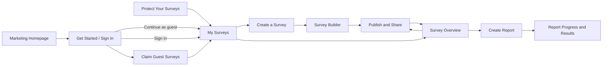
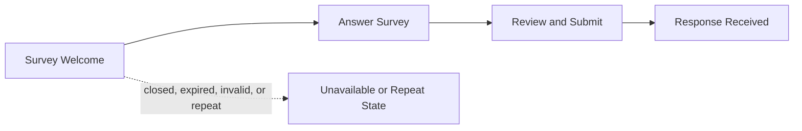

# Saywide — Application Screens

> Screen inventory and functional specification for the organizer and participant MVP flows.

## 1. Scope

This document defines each user-facing screen, its purpose, functional elements, states, and transitions. It complements the [development specification](../development-spec.md), [API endpoints](api-endpoints.md), and [database structure](database-structure.md).

The interface is mobile-first for participants and responsive for organizers. Voice is always optional: every recording interaction has a fully usable text path.

## 2. Experience principles

- Dashboard and Get started open `/start?next=/dashboard` for new visitors and returning guests. Continue as guest is the primary action; signed-in organizers skip the page.
- Survey creation remains directly available at `/create`, with manual creation at `/surveys/new`.
- The shortest successful organizer path is: describe goal → review survey → publish → share.
- Participant access begins from the public link or QR code and never requires an account.
- One primary action is visually dominant on each screen.
- Privacy and recovery limitations appear where they affect a decision, not only in a policy page.
- Counts are labeled as responses or submissions, never verified people.
- Evidence is available behind every material report finding without exposing participant identity.
- Loading, empty, error, permission-denied, expired, and retry states are designed parts of each screen.

## 3. Flow overview

### 3.1 Organizer flow

### 3.2 Participant flow

## 4. Organizer screen inventory

| ID | Screen name | Route | Description | Main functional elements |
|---|---|---|---|---|
| M-01 | Marketing Homepage | `/` | Introduce Saywide and direct visitors to their dashboard. | Saywide brand, two Dashboard calls to action, product heading and slogan, three-slide media carousel. |
| O-01 | Create a Survey | `/create` | Centered voice-first starting point for describing a survey. | Large microphone, recording status and duration, stop/cancel/retry, manual-start action, My Surveys link. |
| O-02 | Survey Builder | `/surveys/new` or `/surveys/{surveyId}/edit` | Create manually or review and edit a persisted survey before publication. | Title and introduction fields, question cards, reorder/add/remove controls, quality warnings, settings, preview, save state, publish button. |
| O-03 | Publish and Share | `/surveys/{surveyId}/share` | Confirm publication and provide safe participant-sharing tools. | Share URL, copy action, QR code, QR download, participant preview, collection status, dashboard link. |
| O-04 | My Surveys | `/dashboard` | Show every survey owned by the current guest workspace or registered account. | Survey cards/table, status filters, response counts, report state, New Survey action, guest recovery warning, account menu. |
| O-05 | Survey Overview | `/surveys/{surveyId}` | Operate one survey and understand collection progress. | Status, aggregate counts, share action, close/reopen controls, expiry, report eligibility, report history, create-report action. |
| O-06 | Create Report | `/surveys/{surveyId}/reports/new` | Capture the organizer's reporting instruction and freeze the response snapshot. | Instruction editor, example prompts, eligible-response count, privacy threshold, generate button, validation and provider errors. |
| O-07 | Report Progress and Results | `/reports/{reportId}` | Show agent progress and then the validated evidence-backed report on the same stable route. | Progress timeline, findings, counts, confidence, evidence drawers, minority views, limitations, suggested actions, Markdown download, regenerate action. |
| O-08 | Protect Your Surveys | `/account/create` | Optionally turn the current guest workspace into a recoverable account. | Email, password, confirmation, password guidance, survey-preservation explanation, create-account button, sign-in alternative. |
| O-09 | Get Started / Sign In | `/start` (`/login` redirects here) | Continue with a guest workspace or sign into an existing account. | Large guest CTA, browser-access explanation, email/password form, secondary Sign in button, registration link. |
| O-10 | Claim Guest Surveys | `/account/claim` | Explicitly transfer surveys from the current guest workspace into the signed-in account. | Guest survey count, destination explanation, confirm checkbox, claim button, skip action, transactional success/error state. |

## 5. Organizer screen details

### O-01 — Create a Survey

**Description:** The AI-assisted creation screen and fastest way to draft a survey. It explains the outcome in one sentence, then lets the organizer state what they want to learn. No account decision interrupts this task.

**Functional elements:**

- Site header and a centered heading explaining what to describe.
- Large microphone with record, stop, cancel, retry, and recording-duration controls.
- Hidden in-memory transcription; no partial or final transcript is displayed or announced.
- Stopping recording finalizes transcription and automatically generates the survey.
- Secondary `Start manually` action for organizers who do not want AI-generated questions.
- Quiet `My surveys` navigation action.
- Loading state that describes survey drafting without exposing model internals.

**Behavior and transitions:**

- The guest workspace is created or restored only when the organizer begins a meaningful action, not merely when the page loads.
- Manual creation remains available if microphone permission or transcription is unavailable. Demo mode does not simulate voice or AI creation.
- Generated creation shows O-02 on the same route, seeded with an unsaved title, participant introduction, and questions. Manual creation opens `/surveys/new` with a blank draft. Both save only on explicit Save draft or Publish.
- Cancellation and navigation stop capture and ignore late results. Incomplete recordings are not used to generate a survey. AI failures may retry the finalized transcript while the page remains open; re-recording clears it.
- API interactions: `POST /api/organizer/guest-session`, `POST /api/organizer/transcription-sessions`, and `POST /api/organizer/draft-survey`. The final endpoint accepts a 12–12,000-character transcript and returns a title (up to 160 characters), introduction (up to 2,000), and 1–20 questions (up to 1,000 characters each). It never persists or publishes a survey. O-02 persists through `POST /api/surveys` on explicit save.

### O-02 — Survey Builder

**Description:** The organizer reviews all generated content and remains in control of the final survey. The screen is optimized for one or more open-ended questions rather than behaving like a general form builder.

**Functional elements:**

- Editable title and participant introduction.
- Ordered question cards with prompt and required-answer controls.
- Add, remove, and keyboard-accessible reorder actions, with no product-level question-count limit.
- Inline warnings for leading, compound, sensitive, or unclear questions.
- Collection settings for expiry, optional access code, and minimum report responses.
- Participant privacy/anonymity statement preview.
- Mobile/desktop participant preview action.
- Visible save status: `Saving`, `Saved`, or a retryable error.
- Primary `Publish survey` action and secondary navigation back to My Surveys.

**Behavior and transitions:**

- Loading uses a builder skeleton; a load failure preserves navigation and offers retry.
- The access code is write-only after save and is never redisplayed from its hash.
- A manual `/surveys/new` draft remains local until it has a non-empty title and at least one valid question; its first save creates the survey and replaces the route with `/surveys/{surveyId}/edit`.
- Questions become non-editable after submitted responses exist; the UI explains why.
- Publishing focuses the first invalid field or navigates to O-03 on success.
- API interactions: `POST /api/surveys` for a new manual draft, then `GET /api/surveys/{surveyId}`, `PATCH /api/surveys/{surveyId}`, and `POST /api/surveys/{surveyId}/publish` for a persisted survey.

### O-03 — Publish and Share

**Description:** A success-focused screen that makes distributing the survey effortless while keeping organizer authorization out of the participant link.

**Functional elements:**

- Clear `Survey is open` confirmation.
- Read-only participant share URL with copy feedback.
- QR code with accessible label, download action, and print-friendly rendering.
- `Open participant preview` action in a new tab.
- Expiry and optional access-code reminder without displaying the stored access code.
- Links to Survey Overview and My Surveys.
- Non-blocking `Protect your surveys` action for guest organizers.

**Behavior and transitions:**

- Reopening this screen returns the existing public token and never rotates a live link accidentally.
- Copy and download failures have visible manual alternatives.
- The QR code contains only the public participant URL.
- API interaction: the publish response supplies the sharing data; later visits load it through `GET /api/surveys/{surveyId}`.

### O-04 — My Surveys

**Description:** The organizer's home after creating the first survey. It restores all surveys available to the current browser guest workspace or registered account.

**Functional elements:**

- Primary `New survey` action.
- Survey cards or responsive table rows showing title, status, question count, submission count, report state, expiry, and last update.
- Filters for all, draft, open, closed, and archived surveys.
- Empty state that returns directly to survey creation.
- Account menu showing guest or registered status without exposing internal IDs.
- Persistent but non-blocking account-protection notice for guests.

**Behavior and transitions:**

- Selecting a draft opens O-02; selecting a published survey opens O-05.
- Missing guest browser credentials show an honest recovery explanation rather than silently claiming old surveys for a new workspace.
- Counts are labeled `submissions` or `responses`, never `people`.
- API interaction: `GET /api/organizer/surveys`.

### O-05 — Survey Overview

**Description:** The operational center for one published survey. It emphasizes collection status and the next useful action instead of exposing a raw participant database.

**Functional elements:**

- Survey title, status badge, expiry, and participant link.
- Submitted and in-progress response counts with clear labels.
- Progress toward the minimum report threshold.
- Copy link, show QR, edit-when-allowed, close, and reopen controls.
- Primary `Create report` action when the threshold is met.
- Disabled report action with an explanation when too few responses exist.
- Report-history list showing instruction summary, snapshot time, status, and result link.
- Empty collection state with a direct sharing action.

**Behavior and transitions:**

- Close and reopen actions require confirmation and update the state without discarding responses.
- The screen does not claim that submissions represent unique participants.
- Individual answers are not browsed here; validated report evidence is shown in O-07.
- API interactions: `GET /api/surveys/{surveyId}`, `GET /api/surveys/{surveyId}/summary`, `POST /api/surveys/{surveyId}/close`, `POST /api/surveys/{surveyId}/reopen`, and `GET /api/surveys/{surveyId}/reports`.

### O-06 — Create Report

**Description:** Lets the organizer ask for the analysis they need in plain language while showing exactly which response snapshot will be analyzed.

**Functional elements:**

- Survey title and eligible submitted-response count.
- Natural-language instruction editor.
- Example request chips such as common problems, popular likes, minority concerns, and practical suggestions.
- Snapshot and privacy-threshold explanation.
- Primary `Generate report` action.
- Too-few-responses, rate-limit, validation, and provider-unavailable states.

**Behavior and transitions:**

- Submitting freezes `snapshotAt` and navigates immediately to O-07.
- The UI never accepts organizer-supplied counts, evidence IDs, or hidden agent instructions.
- A failure before acceptance leaves the instruction intact for retry.
- API interactions: `GET /api/surveys/{surveyId}/summary` and `POST /api/surveys/{surveyId}/reports`.

### O-07 — Report Progress and Results

**Description:** Uses one stable URL for safe live progress and the completed report, avoiding a separate transient loading page.

**Functional elements while running:**

- Report instruction and frozen snapshot time.
- Accessible progress status such as `Preparing`, `Finding themes`, `Checking evidence`, and `Writing report`.
- Reconnecting indicator when the event stream is interrupted.
- Retry action only after a terminal retryable failure.

**Functional elements when complete:**

- Eligible-response count and limitations at the top.
- Ordered finding cards with title, category, summary, support count, support percentage, qualitative confidence, and suggested action.
- Expandable evidence showing safe excerpts and pseudonymous response labels.
- Dedicated minority-views and follow-up-questions sections when present.
- `Download Markdown`, `Create another report`, and `Back to survey` actions.

**Behavior and transitions:**

- Progress events never display prompts, raw answers, credentials, or provider payloads.
- Evidence expansion is keyboard accessible and does not expose internal answer IDs.
- Percentages always use the eligible frozen response count as denominator.
- API interactions: `GET /api/reports/{reportId}` and `GET /api/reports/{reportId}/events`.

### O-08 — Protect Your Surveys

**Description:** Optional account creation for a guest who wants access across devices. Password recovery and email verification are deferred. The guest count is read from the session API; there are no fixed demo counts in live screens.

**Functional elements:**

- Existing guest survey count and preservation explanation.
- Email, password, and password-confirmation fields.
- Clear password requirements and show/hide controls.
- Primary `Create account` action.
- `Already have an account? Sign in` path.
- Reminder that clearing browser data before protection may remove guest access.

**Behavior and transitions:**

- Successful registration promotes the existing workspace and returns to O-04 without moving surveys.
- An email that cannot create a new account shows a neutral inline error with a sign-in alternative; existing guest work remains accessible.
- Validation errors retain the email but never the password after navigation.
- API interaction: `POST /api/auth/register`.

### O-09 — Sign In

**Description:** A centered white panel on a softly shaded background. A full-width green Continue as guest button appears above a conventional sign-in form and registration link. Existing Saywide typography, Lucide icons, and a restrained shimmer treatment are reused. Mobile follows the same order with natural scrolling; reduced motion disables shimmer.

**Functional elements:**

- Email and password fields with show/hide password control.
- Primary `Continue as guest` action, followed by a separator and secondary `Sign in` action.
- Generic invalid-credentials and rate-limit states.
- Short explanation that guest access is linked to this browser.
- Links back to survey creation and account creation where appropriate.

**Behavior and transitions:**

- Continue as guest restores an existing guest workspace or creates one, then goes to O-04. Returning guests see this choice again when clicking Dashboard/Get started; direct reloads of accessible organizer pages continue normally.
- Successful login with no pending guest workspace goes to O-04. Recognized organizer destinations in `next` are preserved through entry, registration, and claiming; unknown or external destinations fall back to `/dashboard`.
- Successful login with pending guest surveys goes to O-10; it never transfers them automatically.
- Password reset and email verification are outside the MVP and are not shown as non-working controls.
- API interactions: `GET /api/auth/session`, `POST /api/organizer/guest-session`, and `POST /api/auth/login`. Session cookies stay on the API host. Logout revokes the current account session and returns to the entry page without deleting surveys.

### O-10 — Claim Guest Surveys

**Description:** Makes a potentially surprising ownership transfer explicit after an organizer signs into an existing account while guest surveys remain in the browser.

**Functional elements:**

- Actual guest survey count and destination account email, followed by explicit confirmation.
- Confirmation checkbox describing the transfer and guest credential revocation.
- Primary `Move surveys to my account` action.
- Secondary `Not now` action that keeps both sessions intact.
- In-progress state that prevents duplicate submission.
- Clear transactional success or retryable failure message.

**Behavior and transitions:**

- Success navigates to O-04 with the transferred surveys visible.
- Failure leaves ownership and credentials unchanged. Not now sends no claim request and leaves a Move guest surveys action on the registered dashboard.
- The action requires both the guest and account cookies plus explicit confirmation.
- API interaction: `POST /api/auth/claim-guest`.

## 6. Participant screen inventory

| ID | Screen name | Route | Description | Main functional elements |
|---|---|---|---|---|
| P-01 | Survey Welcome | `/s/{publicToken}` | Explain the survey, privacy expectations, time, and consent before starting. | Title, introduction, question count, estimated time, privacy notice, consent action, optional access code, Start button. |
| P-02 | Answer Survey | `/s/{publicToken}/respond` | Capture one text or voice answer at a time with visible progress and local draft protection. | Progress indicator, question prompt, text editor, microphone controls, live transcript, previous/next actions, save state. |
| P-03 | Review and Submit | `/s/{publicToken}/review` | Let the participant review and correct every answer before final submission. | Answer summary cards, edit links, missing-answer validation, consent reminder, submit button. |
| P-04 | Response Received | `/s/{publicToken}/complete` | Confirm successful submission without creating a participant identity. | Success message, submission time, privacy reminder, close action. |
| P-05 | Survey Unavailable or Repeat State | `/s/{publicToken}` | Explain why the normal response flow cannot start. | Invalid/closed/expired state, same-browser repeat warning or block, retry action where useful, organizer contact guidance only if supplied in public copy. |

## 7. Participant screen details

### P-01 — Survey Welcome

**Description:** The participant-facing entry from a shared link or QR code. It establishes trust and expectations before creating a response session or requesting microphone access.

**Functional elements:**

- Survey title and organizer-provided introduction.
- Number of questions and estimated completion time.
- Plain-language statement that the app does not ask for an account, name, or email.
- Explanation that voice audio is streamed for immediate transcription, is not retained, and can be replaced by typing.
- Consent notice and explicit start action tied to its version.
- Optional access-code field when configured.
- Primary `Start survey` button.

**Behavior and transitions:**

- The screen does not request microphone permission before the participant chooses voice on P-02.
- Starting validates the access code and consent, creates the anonymous response session, keeps the raw bearer token in memory, and navigates to P-02.
- A local same-survey submission marker routes to P-05 according to the configured soft repeat behavior.
- API interactions: `GET /api/public/s/{publicToken}` and `POST /api/public/s/{publicToken}/sessions`.

### P-02 — Answer Survey

**Description:** A focused, one-question-at-a-time experience optimized for phones. Text and voice share the same editable answer field so the participant always controls the submitted wording.

**Functional elements:**

- Question number and total-question progress.
- Current question prompt and required/optional label.
- Large multiline text editor.
- Microphone action with states: idle, requesting permission, recording, finalizing transcript, and error.
- Recording timer, two-minute limit, stop, cancel, and retry controls.
- Live partial transcript presentation and clearly marked final transcript.
- Previous and Next/Review actions.
- Local save indicator and unobtrusive privacy reminder.

**Behavior and transitions:**

- Starting voice requests a signed stream only after response-session bearer authorization.
- Partial transcript text is not treated as final; the participant can edit accepted final text freely.
- Recording over existing text asks before replacement or inserts at the cursor according to the final UI decision.
- Moving between questions saves approved text through the API and preserves a local draft.
- A page reload restores the local draft, creates a fresh response session because the bearer token was memory-only, and resaves the restored answers before submission.
- Microphone, network, or Transcribe failure leaves existing text intact and keeps typing available.
- API interactions: `POST /api/public/sessions/{sessionId}/transcription-sessions` and `PUT /api/public/sessions/{sessionId}/answers/{questionId}`.

### P-03 — Review and Submit

**Description:** A final checkpoint where the participant can see exactly what will be stored and correct transcription errors before making the response immutable.

**Functional elements:**

- Ordered question-and-answer summary cards.
- Edit action returning to the selected question on P-02.
- Missing required-answer messages with direct navigation.
- Reminder that only displayed text will be submitted and raw audio is not retained.
- Consent-version confirmation.
- Primary `Submit response` button with duplicate-click protection.

**Behavior and transitions:**

- Validation focuses the first missing required answer.
- Submission disables repeated actions until a response arrives.
- A retry after an uncertain network result uses the same session and returns the original success when already submitted.
- Success clears the raw in-memory bearer token and local drafts, writes the soft browser submission marker, and navigates to P-04.
- API interaction: `POST /api/public/sessions/{sessionId}/submit`.

### P-04 — Response Received

**Description:** A neutral confirmation that the response was accepted. It does not imply that the participant has an account or can later retrieve other responses.

**Functional elements:**

- Clear success icon and `Response received` heading.
- Submission timestamp or simple completion confirmation.
- Short statement that only the approved text was stored.
- `Close` or `Done` action appropriate to a browser opened from a QR code.

**Behavior and transitions:**

- Refreshing remains on a safe confirmation state using the local submission marker and never resubmits.
- The page does not show organizer controls, response counts, other answers, or a participant profile.

### P-05 — Survey Unavailable or Repeat State

**Description:** A shared set of participant-safe terminal or recoverable states rendered at the public route.

**Functional elements:**

- Distinct plain-language messages for invalid link, closed survey, expired survey, invalid access code, temporary loading failure, and same-browser repeat detection.
- Retry action only for temporary failures.
- Return-to-introduction action after an access-code error.
- No sign-in or registration prompt.

**Behavior and transitions:**

- Invalid, closed, and expired states reveal no organizer identity or survey data beyond safe public copy.
- A same-browser repeat message accurately calls the limit browser-based and does not claim verified identity enforcement.
- Incognito mode, cleared storage, and another device can bypass the marker; this limitation is not presented as a participant authentication feature.

## 8. Shared interface states

### Loading

- Use layout-preserving skeletons for page data and small inline indicators for actions.
- Keep button labels stable while adding a progress indicator.
- Report progress uses meaningful safe states rather than an indefinite spinner.

### Empty

- Every empty state explains why it is empty and offers one relevant next action.
- Organizer empty states lead to creation or sharing; participant empty answers remain editable rather than looking like errors.

### Errors

- Put field errors beside the field and summarize them at the top for screen-reader navigation.
- Preserve safe user input after recoverable failures.
- Use the API's stable safe error categories; never display raw provider or database errors.
- Distinguish retryable service failures from permanent closed, expired, unauthorized, or invalid-link states.

### Connectivity and refresh

- The frontend preserves active text drafts locally during participant response entry.
- The raw participant bearer token and presigned AWS URL remain memory-only.
- Organizer cookie sessions are restored by the API; losing an unregistered guest cookie triggers the documented recovery limitation.
- Interrupted report-event streaming reconnects using the last event ID and falls back to polling the report endpoint if needed.

## 9. Responsive and accessibility requirements

- Participant screens prioritize one-column phone layouts and thumb-reachable primary actions.
- Organizer tables collapse into cards without dropping status, counts, or primary actions.
- Touch targets are at least 44 by 44 CSS pixels.
- All functionality is keyboard operable with visible focus indication.
- Recording and transcription state changes use an `aria-live` region and visible text.
- Progress is communicated by text and semantics, not color alone.
- Dialogs trap focus, have descriptive titles, and restore focus to their trigger.
- Evidence disclosures use accessible buttons and expanded-state attributes.
- Error summaries link to invalid inputs, and required fields are programmatically identified.
- Content remains usable at browser zoom and with enlarged mobile text.
- QR codes always have an adjacent copyable URL.

## 10. MVP screen acceptance criteria

- A new organizer reaches O-02 from O-01 without encountering an account gate.
- An organizer can create, edit, publish, share, close, reopen, and report on a survey using only the documented screens.
- A guest organizer can return to O-04 in the same browser and optionally protect all surveys through O-08.
- Login never silently claims guest surveys; O-10 requires explicit confirmation.
- A participant completes P-01 through P-04 by text only or by voice plus transcript review.
- Every voice failure preserves the typed path and active draft.
- Participant bearer tokens, raw audio, and presigned URLs are never displayed or persisted.
- All submitted text is visible and editable on P-03 before it becomes immutable.
- Report findings on O-07 show deterministic support and expandable validated evidence.
- Closed, expired, invalid, duplicate-click, rate-limit, permission-denied, and provider-failure states have defined UI behavior.
