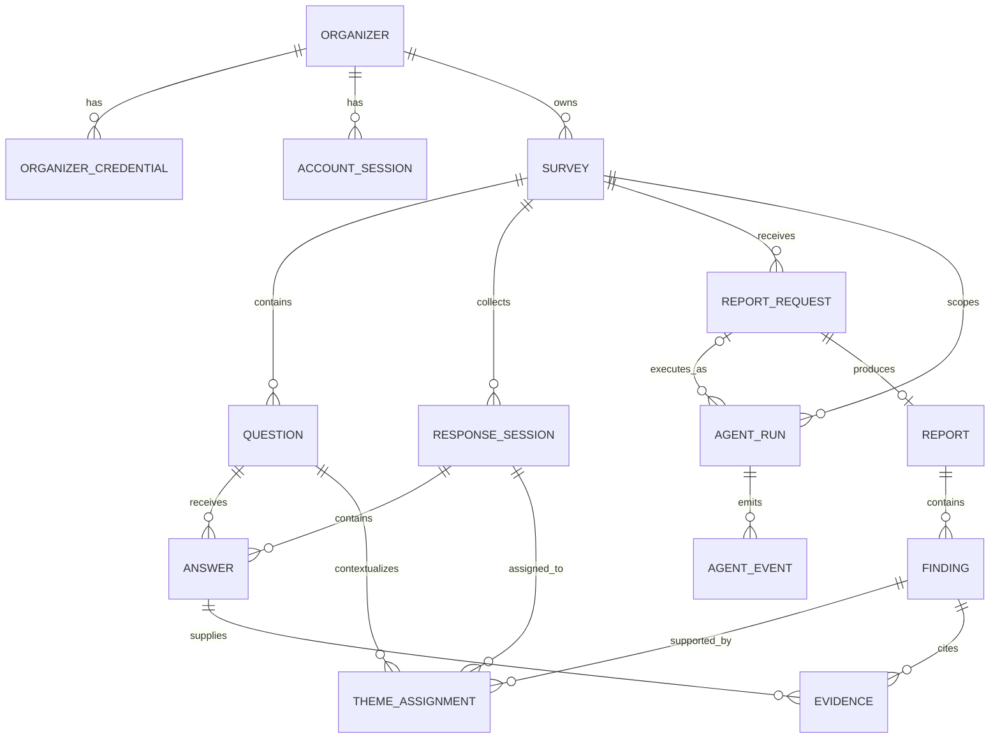

# Saywide — Database Structure

> Authoritative PostgreSQL schema design for the Saywide MVP.

## 1. Scope

This document defines the database tables, fields, relationships, constraints, indexes, and lifecycle rules for Saywide. It is the detailed database companion to the [development specification](../development-spec.md).

Only the Fastify backend connects to PostgreSQL. The frontend communicates with the backend through the HTTP API and never receives database credentials or imports database models.

The schema deliberately has no participant, participant account, participant email, or participant profile table. Anonymous submissions are represented by short-lived response sessions and finalized answers.

## 2. Conventions

- Table and column names use `snake_case`.
- Primary keys use application-generated UUIDs stored as PostgreSQL `uuid` values.
- Timestamps use `timestamptz`, are stored in UTC, and default to `now()` where applicable.
- Mutable records have `created_at` and `updated_at`; append-only records normally have only `created_at`.
- Status and kind fields use `text` with database `CHECK` constraints. This keeps migrations simple while preventing unsupported states.
- High-entropy bearer credentials are stored only as hashes in `bytea` columns. Raw credentials never enter the database, logs, analytics, or URLs.
- Passwords and optional survey access codes use a slow password-hashing function and are stored as encoded hashes in `text` columns.
- Raw audio, presigned Amazon Transcribe URLs, authorization headers, and participant browser markers are never stored in PostgreSQL.
- Foreign keys use `ON DELETE CASCADE` for records wholly owned by a parent unless a more restrictive rule is stated.

## 3. Relationship overview

## 4. Tables

### 4.1 `organizer`

Stores one organizer workspace. A workspace starts as a browser-bound guest and may later become a registered email/password account. When a guest workspace is claimed by an existing account, the guest record becomes a merge tombstone after its resources are transferred.

| Field | PostgreSQL type | Nullable | Default | Description |
|---|---|---:|---|---|
| `id` | `uuid` | No | Application generated | Primary key for the organizer workspace. It is an internal identifier and is never accepted as proof of authorization. |
| `kind` | `text` | No | `'guest'` | Organizer type: `guest` or `registered`. |
| `status` | `text` | No | `'active'` | Lifecycle state: `active` or `merged`. Only an active organizer may own usable credentials or sessions. |
| `merged_into_organizer_id` | `uuid` | Yes | `NULL` | Self-referencing foreign key to the registered organizer that received this guest's resources. Required when `status = 'merged'`; otherwise null. Uses `ON DELETE RESTRICT` so the merge audit link cannot silently disappear. |
| `email` | `text` | Yes | `NULL` | Normalized lowercase email for a registered organizer. Null for guests and merged guest tombstones. A partial unique index applies to non-null values. |
| `password_hash` | `text` | Yes | `NULL` | Encoded strong password hash for a registered organizer. Never contains plaintext or reversibly encrypted passwords. Null for guests. |
| `created_at` | `timestamptz` | No | `now()` | Time the guest workspace was first created. |
| `updated_at` | `timestamptz` | No | `now()` | Time the organizer kind, status, email, password hash, or merge target last changed. |

### 4.2 `organizer_credential`

Stores revocable credentials for browser-bound guest organizers. The browser receives the raw credential in a host-only secure cookie; PostgreSQL stores only its hash.

| Field | PostgreSQL type | Nullable | Default | Description |
|---|---|---:|---|---|
| `id` | `uuid` | No | Application generated | Primary key for the credential record. |
| `organizer_id` | `uuid` | No | — | Foreign key to `organizer.id`. The referenced organizer must be an active guest. Uses `ON DELETE CASCADE`. |
| `token_hash` | `bytea` | No | — | One-way hash of the high-entropy guest bearer credential. Unique across all organizer credentials. |
| `expires_at` | `timestamptz` | No | — | Time after which the credential cannot authorize organizer operations. It must cover the intended collection period or be renewed before publication. |
| `last_used_at` | `timestamptz` | Yes | `NULL` | Most recent successful authorization time, used for lifecycle visibility without storing browsing history. |
| `revoked_at` | `timestamptz` | Yes | `NULL` | Time the credential was explicitly invalidated. A non-null value makes the credential unusable even before expiry. |
| `created_at` | `timestamptz` | No | `now()` | Time the credential was issued. |

### 4.3 `account_session`

Stores revocable login sessions for registered organizers. The raw session token is placed in a host-only secure cookie and only its hash is persisted.

| Field | PostgreSQL type | Nullable | Default | Description |
|---|---|---:|---|---|
| `id` | `uuid` | No | Application generated | Primary key for the account session. |
| `organizer_id` | `uuid` | No | — | Foreign key to an active registered `organizer`. Uses `ON DELETE CASCADE`. |
| `token_hash` | `bytea` | No | — | One-way hash of the high-entropy account-session bearer token. Unique across all account sessions. |
| `expires_at` | `timestamptz` | No | — | Absolute session expiry checked on every authenticated request. |
| `last_used_at` | `timestamptz` | Yes | `NULL` | Most recent successful use of the session. Updates should be throttled to avoid a write on every request. |
| `revoked_at` | `timestamptz` | Yes | `NULL` | Time the session was invalidated by logout, credential rotation, or administrative action. |
| `created_at` | `timestamptz` | No | `now()` | Time the account session was issued. |

### 4.4 `survey`

Stores organizer-owned survey metadata, publication state, privacy controls, and reporting threshold.

| Field | PostgreSQL type | Nullable | Default | Description |
|---|---|---:|---|---|
| `id` | `uuid` | No | Application generated | Primary key for the survey. |
| `organizer_id` | `uuid` | No | — | Foreign key to the organizer that owns and administers the survey. Uses `ON DELETE CASCADE`. Every organizer query must scope through this field. |
| `public_token` | `text` | No | — | High-entropy, unique token used in the participant share link and QR code. It is not derived from `id` and never grants organizer access. |
| `title` | `text` | No | — | Organizer-editable survey title shown to participants and in the dashboard. Must not be blank. |
| `intro` | `text` | No | `''` | Short participant-facing purpose and context for the survey. |
| `status` | `text` | No | `'draft'` | Lifecycle state: `draft`, `open`, `closed`, or `archived`. Only open surveys accept new response sessions. |
| `access_code_hash` | `text` | Yes | `NULL` | Encoded password hash for an optional participant access code. Null when the public link alone is sufficient. |
| `min_report_responses` | `smallint` | No | `2` | Minimum number of submitted response sessions required before report generation. Must be at least 1. |
| `expires_at` | `timestamptz` | Yes | `NULL` | Optional time after which new response sessions are rejected. Null means no scheduled expiry. |
| `created_at` | `timestamptz` | No | `now()` | Time the survey draft was created. |
| `updated_at` | `timestamptz` | No | `now()` | Time the editable survey metadata, settings, or lifecycle state last changed. |

### 4.5 `question`

Stores ordered open-ended questions belonging to a survey.

| Field | PostgreSQL type | Nullable | Default | Description |
|---|---|---:|---|---|
| `id` | `uuid` | No | Application generated | Primary key for the question. |
| `survey_id` | `uuid` | No | — | Foreign key to `survey.id`. Uses `ON DELETE CASCADE`. |
| `position` | `smallint` | No | — | One-based display order within the survey. Unique per survey and limited to the supported question range. |
| `prompt` | `text` | No | — | Participant-facing open-ended question text. Must not be blank. |
| `required` | `boolean` | No | `true` | Whether the response must contain a non-empty answer before submission. |
| `created_at` | `timestamptz` | No | `now()` | Time the question was created. |
| `updated_at` | `timestamptz` | No | `now()` | Time the prompt, position, or required flag last changed. Published survey questions should become immutable once responses exist. |

### 4.6 `response_session`

Represents one anonymous attempt to answer a survey. It is an authorization and submission boundary, not a participant identity and not proof of a unique person.

| Field | PostgreSQL type | Nullable | Default | Description |
|---|---|---:|---|---|
| `id` | `uuid` | No | Application generated | Internal primary key for the response session. It is not exposed as an API capability. |
| `client_session_id` | `uuid` | No | Application generated | Random, unique, non-secret reference returned as `sessionId` and used in API paths. It grants no access without the bearer token. |
| `survey_id` | `uuid` | No | — | Foreign key to the survey being answered. Uses `ON DELETE CASCADE`. |
| `session_token_hash` | `bytea` | No | — | One-way hash of the short-lived response-session bearer token. The raw token is returned once and kept only in browser memory. |
| `public_label` | `text` | No | — | Survey-scoped pseudonymous label such as `Response A12`, used to attribute evidence without exposing identity. Unique within a survey. |
| `status` | `text` | No | `'started'` | Lifecycle state: `started`, `transcribing`, `ready`, `submitted`, or `failed`. |
| `consent_version` | `text` | No | — | Version identifier of the privacy/consent notice accepted before the response was recorded or submitted. It records the notice version, not participant identity. |
| `expires_at` | `timestamptz` | No | — | Time after which the bearer token and unfinished session can no longer be used. |
| `submitted_at` | `timestamptz` | Yes | `NULL` | Time the response became final and immutable. Required only when `status = 'submitted'`. |
| `created_at` | `timestamptz` | No | `now()` | Time the anonymous response session was started. |
| `updated_at` | `timestamptz` | No | `now()` | Time the session status or submission state last changed. |

### 4.7 `answer`

Stores the participant-approved final text for one survey question. It never stores raw audio.

| Field | PostgreSQL type | Nullable | Default | Description |
|---|---|---:|---|---|
| `id` | `uuid` | No | Application generated | Primary key for the answer. |
| `response_session_id` | `uuid` | No | — | Foreign key to `response_session.id`. Uses `ON DELETE CASCADE`. |
| `question_id` | `uuid` | No | — | Deferred foreign key to `question.id`. A question referenced by an answer cannot be deleted alone, while deleting the owning survey can cascade the complete graph atomically. The question and response session must belong to the same survey. |
| `final_text` | `text` | No | — | Participant-reviewed answer text used for reporting. Required answers must not be blank at submission. |
| `input_mode` | `text` | No | — | How the final answer originated: `text` or `voice`. Voice still stores only approved text. |
| `audio_status` | `text` | No | `'not_used'` | Audio-processing outcome: `not_used`, `streamed_and_discarded`, or `failed_and_discarded`. It is metadata only and never points to an audio object. |
| `created_at` | `timestamptz` | No | `now()` | Time the answer record was first created. |
| `updated_at` | `timestamptz` | No | `now()` | Time the participant last edited the answer before submission. Answers become immutable after their response session is submitted. |

### 4.8 `report_request`

Stores an organizer's plain-language instruction and the frozen response cutoff used to produce a report. A failed request can have multiple agent runs while retaining the same requested snapshot.

| Field | PostgreSQL type | Nullable | Default | Description |
|---|---|---:|---|---|
| `id` | `uuid` | No | Application generated | Primary key for the report request. |
| `survey_id` | `uuid` | No | — | Foreign key to the survey being analyzed. Uses `ON DELETE CASCADE`. |
| `instruction` | `text` | No | — | Organizer's natural-language reporting request. Must not be blank. |
| `snapshot_at` | `timestamptz` | No | — | Frozen cutoff; only responses submitted on or before this time are eligible for the report. |
| `status` | `text` | No | `'queued'` | Request state: `queued`, `preparing`, `analyzing`, `validating`, `completed`, or `failed`. |
| `completed_at` | `timestamptz` | Yes | `NULL` | Time a validated report was successfully persisted. Null before completion or after failure. |
| `created_at` | `timestamptz` | No | `now()` | Time the organizer submitted the report instruction. |
| `updated_at` | `timestamptz` | No | `now()` | Time the request status or completion metadata last changed. |

### 4.9 `agent_run`

Stores one execution attempt of a Strands agent. This table closes the run-trace relationship used by report requests and agent events and preserves failed attempts for debugging.

| Field | PostgreSQL type | Nullable | Default | Description |
|---|---|---:|---|---|
| `id` | `uuid` | No | Application generated | Primary key and correlation identifier for one agent execution. |
| `survey_id` | `uuid` | No | — | Foreign key to the survey that scopes all tools and data available to the run. Uses `ON DELETE CASCADE`. |
| `report_request_id` | `uuid` | Yes | `NULL` | Foreign key to `report_request.id` for report runs. Null for survey-creation runs. Uses `ON DELETE CASCADE`. |
| `run_type` | `text` | No | — | Agent purpose: `survey_creation` or `report`. |
| `status` | `text` | No | `'queued'` | Execution state: `queued`, `running`, `completed`, or `failed`. |
| `model_provider` | `text` | No | — | Provider used for the run, normally `amazon_bedrock` in the MVP. |
| `model_id` | `text` | No | — | Exact provider model identifier used to make the run reproducible and debuggable. |
| `started_at` | `timestamptz` | Yes | `NULL` | Time execution began. Null while queued. |
| `completed_at` | `timestamptz` | Yes | `NULL` | Time execution reached a terminal state. |
| `error_code` | `text` | Yes | `NULL` | Safe application error category for failed runs. It must not contain prompts, answers, credentials, or provider payloads. |
| `usage` | `jsonb` | No | `'{}'::jsonb` | Safe numeric usage metadata such as input/output token counts and estimated provider units; never stores response content. |
| `created_at` | `timestamptz` | No | `now()` | Time the run record was created. |
| `updated_at` | `timestamptz` | No | `now()` | Time the run status, timing, error category, or usage metadata last changed. |

### 4.10 `agent_event`

Stores ordered, privacy-safe progress and tool events emitted by an agent run. These events support the developer trace and organizer-friendly progress UI without storing hidden prompts or respondent text.

| Field | PostgreSQL type | Nullable | Default | Description |
|---|---|---:|---|---|
| `id` | `uuid` | No | Application generated | Primary key for the event. |
| `agent_run_id` | `uuid` | No | — | Foreign key to `agent_run.id`. Uses `ON DELETE CASCADE`. |
| `sequence` | `integer` | No | — | Monotonically increasing order within one run. Unique together with `agent_run_id`. |
| `event_type` | `text` | No | — | Safe event category such as `state_changed`, `tool_started`, `tool_completed`, or `validation_failed`. |
| `tool_name` | `text` | Yes | `NULL` | Allowlisted Strands tool name for tool-related events; null for general state events. |
| `duration_ms` | `integer` | Yes | `NULL` | Non-negative execution duration for a completed operation. |
| `safe_metadata` | `jsonb` | No | `'{}'::jsonb` | Redacted diagnostic metadata containing no answers, transcript text, prompts, credentials, authorization headers, or presigned URLs. |
| `created_at` | `timestamptz` | No | `now()` | Time the event was emitted. |

### 4.11 `report`

Stores the immutable, validated report produced for one report request.

| Field | PostgreSQL type | Nullable | Default | Description |
|---|---|---:|---|---|
| `id` | `uuid` | No | Application generated | Primary key for the report. |
| `report_request_id` | `uuid` | No | — | Unique foreign key to `report_request.id`, enforcing at most one completed report per request. Uses `ON DELETE CASCADE`. |
| `schema_version` | `text` | No | — | Version of the structured report contract used to validate and render this report. |
| `markdown` | `text` | No | — | Final organizer-facing Markdown generated only after deterministic count, evidence, and privacy validation. |
| `eligible_response_count` | `integer` | No | — | Number of submitted response sessions included in the frozen snapshot. Must be non-negative and meet the survey threshold. |
| `limitations` | `jsonb` | No | `'[]'::jsonb` | Ordered array of plain-language caveats included with the report. |
| `minority_views` | `jsonb` | No | `'[]'::jsonb` | Ordered array of validated minority-view summaries included with the report. Added by migration `002_report_sections`. |
| `follow_up_questions` | `jsonb` | No | `'[]'::jsonb` | Ordered array of bounded follow-up questions included with the report. Added by migration `002_report_sections`. |
| `created_at` | `timestamptz` | No | `now()` | Time the validated report was persisted. |

### 4.12 `finding`

Stores one ordered, evidence-backed finding within a report. Counts are calculated by deterministic application code rather than trusted from model output.

| Field | PostgreSQL type | Nullable | Default | Description |
|---|---|---:|---|---|
| `id` | `uuid` | No | Application generated | Primary key for the finding. |
| `report_id` | `uuid` | No | — | Foreign key to `report.id`. Uses `ON DELETE CASCADE`. |
| `position` | `smallint` | No | — | One-based display order within the report. Unique per report. |
| `title` | `text` | No | — | Short organizer-facing name for the consolidated theme or concern. |
| `category` | `text` | No | — | Stable application category: `strength`, `friction`, `minority-view`, or `opportunity`. |
| `summary` | `text` | No | — | Plain-language explanation of the finding, bounded by validated evidence. |
| `support_count` | `integer` | No | — | Deterministic number of distinct eligible response sessions assigned to this finding. Must be non-negative. |
| `support_percent` | `numeric(5,2)` | No | — | `support_count / eligible_response_count * 100`, rounded consistently and constrained from 0 through 100. |
| `confidence` | `text` | No | — | Qualitative confidence: `low`, `medium`, or `high`. It is not a statistical probability. |
| `suggested_action` | `text` | Yes | `NULL` | Optional practical action clearly presented as a suggestion for organizer review. |
| `created_at` | `timestamptz` | No | `now()` | Time the validated finding was persisted. |

### 4.13 `theme_assignment`

Records that one distinct response session supports one finding and identifies the question that provides the clearest context. These rows are the reproducible source for `finding.support_count`.

| Field | PostgreSQL type | Nullable | Default | Description |
|---|---|---:|---|---|
| `finding_id` | `uuid` | No | — | Foreign key to `finding.id`. Uses `ON DELETE CASCADE`. Part of the composite primary key. |
| `response_session_id` | `uuid` | No | — | Foreign key to an eligible submitted `response_session`. Uses `ON DELETE CASCADE`. Part of the composite primary key, so one response contributes at most one count to a finding. |
| `question_id` | `uuid` | No | — | Deferred foreign key to the question containing the representative supporting answer. The question, response session, finding, and report must ultimately belong to the same survey snapshot. |
| `reason` | `text` | No | — | Short, safe rationale for the semantic assignment. It must not contain hidden prompts or unrelated response text. |
| `validated` | `boolean` | No | `false` | Whether deterministic validation confirmed the referenced response/question relationship and eligibility. Only validated rows contribute to final counts. |
| `created_at` | `timestamptz` | No | `now()` | Time the proposed assignment was persisted. |

The composite primary key is (`finding_id`, `response_session_id`). This prevents multiple answers from the same response from inflating a finding's support count.

### 4.14 `evidence`

Stores a privacy-reviewed excerpt that supports one finding and links it to the exact finalized answer from which it came.

| Field | PostgreSQL type | Nullable | Default | Description |
|---|---|---:|---|---|
| `id` | `uuid` | No | Application generated | Primary key for the evidence item. |
| `finding_id` | `uuid` | No | — | Foreign key to `finding.id`. Uses `ON DELETE CASCADE`. |
| `answer_id` | `uuid` | No | — | Foreign key to the source `answer.id`. Uses `ON DELETE CASCADE`. The answer must be in the report's frozen survey snapshot. |
| `safe_excerpt` | `text` | No | — | Short redacted or paraphrased excerpt approved for organizer display. It must not expose identifying or unnecessarily sensitive details. |
| `public_response_label` | `text` | No | — | Snapshot of the response's pseudonymous label used in the report UI. It avoids displaying internal IDs and remains stable if labeling logic later changes. |
| `created_at` | `timestamptz` | No | `now()` | Time the validated evidence item was persisted. |

### 4.15 `idempotency_operation`

Stores bounded retry records for operations where a lost HTTP response must not
create a second survey or anonymous response session. This is operational state
in addition to the fourteen product-domain tables above.

| Field | PostgreSQL type | Nullable | Default | Description |
|---|---|---:|---|---|
| `id` | `uuid` | No | Application generated | Primary key and non-secret derivation input for retryable response sessions. |
| `scope_kind` | `text` | No | — | Retry scope: `organizer` or `public_survey`. |
| `scope_id` | `uuid` | No | — | Authorized organizer or internal public-survey context. It is not exposed to the caller. |
| `operation` | `text` | No | — | Stable operation name such as `create_survey`, `start_response`, or `create_report`. |
| `key_hash` | `bytea` | No | — | One-way hash of the caller's idempotency key; the raw header is never stored. |
| `request_hash` | `bytea` | No | — | Canonical request-body hash used to reject reuse with different input. |
| `resource_id` | `uuid` | No | — | Internal resource produced by the successful operation. |
| `expires_at` | `timestamptz` | No | — | Bounded time until the retry record may be removed. |
| `created_at` | `timestamptz` | No | `now()` | Time the protected operation completed. |

## 5. Required constraints and indexes

### 5.1 Unique constraints

- Partial unique index on normalized `organizer.email` where the value is not null.
- Unique `organizer_credential.token_hash` and `account_session.token_hash`.
- Unique `survey.public_token`.
- Unique (`question.survey_id`, `question.position`).
- Unique `response_session.client_session_id` and `response_session.session_token_hash`.
- Unique (`response_session.survey_id`, `response_session.public_label`).
- Unique (`answer.response_session_id`, `answer.question_id`).
- Unique (`agent_event.agent_run_id`, `agent_event.sequence`).
- Unique `report.report_request_id`.
- Unique (`finding.report_id`, `finding.position`).
- Composite primary key (`theme_assignment.finding_id`, `theme_assignment.response_session_id`).
- Unique (`idempotency_operation.scope_kind`, `scope_id`, `operation`, `key_hash`).

### 5.2 Check constraints

- `organizer.kind` is `guest` or `registered`; `organizer.status` is `active` or `merged`.
- Active guests have null email/password fields. Active registered organizers have both fields. Merged guests have a merge target and no usable credentials.
- `survey.status` is `draft`, `open`, `closed`, or `archived`; `min_report_responses >= 1`.
- `question.position` is between 1 and 5 for the MVP.
- `response_session.status` is `started`, `transcribing`, `ready`, `submitted`, or `failed`; `submitted_at` is present exactly when the state is submitted.
- `answer.input_mode` is `text` or `voice`; `answer.audio_status` is `not_used`, `streamed_and_discarded`, or `failed_and_discarded`.
- `report_request.status` is `queued`, `preparing`, `analyzing`, `validating`, `completed`, or `failed`; `completed_at` is present only for completed requests.
- `agent_run.run_type` is `survey_creation` or `report`; `agent_run.status` is `queued`, `running`, `completed`, or `failed`; report runs require a report request and survey-creation runs do not have one.
- `agent_event.sequence > 0` and `agent_event.duration_ms >= 0` when duration is present.
- `report.eligible_response_count >= 0`.
- `finding.position > 0`, `finding.support_count >= 0`, `finding.support_percent BETWEEN 0 AND 100`, and `finding.confidence` is `low`, `medium`, or `high`.

### 5.3 Query indexes

- `survey(organizer_id, status, updated_at DESC)` for organizer dashboards.
- `question(survey_id, position)` for public survey rendering.
- `response_session(survey_id, status, submitted_at)` for counts and frozen report snapshots.
- `answer(response_session_id, question_id)` for loading a response snapshot.
- `report_request(survey_id, created_at DESC)` for report history.
- `agent_run(report_request_id, created_at DESC)` for retries and trace lookup.
- `agent_event(agent_run_id, sequence)` for ordered progress streaming.
- `finding(report_id, position)` and `evidence(finding_id, created_at)` for report rendering.
- `idempotency_operation(expires_at)` for bounded cleanup.

### 5.4 Cross-table invariants

- An answer's question and response session belong to the same survey.
- A report request can use only submitted responses belonging to its survey with `submitted_at <= snapshot_at`.
- A report run's `survey_id` matches its report request's survey.
- A theme assignment's response session and question belong to the report's survey and frozen snapshot.
- Evidence references an answer in the report's survey and frozen snapshot.
- `finding.support_count` equals the count of validated theme assignments for that finding.
- `finding.support_percent` is derived from the finding's support count and its report's eligible response count.
- Reports and their findings, assignments, and evidence are immutable after successful validation.

These invariants must be enforced transactionally in backend services. Straightforward ownership and uniqueness rules should also be enforced by foreign keys, unique constraints, and `CHECK` constraints.

## 6. Lifecycle and deletion

- Guest-to-new-account promotion updates the existing `organizer` row atomically, preserving survey ownership and revoking guest credentials.
- Claiming a guest workspace into an existing account transfers all surveys in one transaction, marks the guest organizer as merged, and revokes its credentials. Any failure rolls back the entire claim.
- Submitting a response atomically validates required answers, changes the response state to `submitted`, sets `submitted_at`, and makes its answers immutable.
- Generating a report freezes `snapshot_at`. Newer submissions do not change the completed report.
- Deleting a survey cascades through questions, response sessions, answers, report requests, agent runs, events, reports, findings, assignments, and evidence.
- Deleting an organizer cascades through its active credentials, account sessions, and owned surveys. A registered organizer referenced by a merge tombstone cannot be deleted until that relationship is explicitly resolved.
- Expired or abandoned response sessions may be deleted after a short operational retention window, provided they were never submitted.
- Expired idempotency records are operational data and may be deleted after `expires_at`.
- Finalized response text and reports follow the organizer-controlled retention policy. Raw audio requires no cleanup job because it is never durably stored.

## 7. Migration ownership

- Migration files live in `backend/migrations/` and are the source of truth for the physical schema.
- Migrations run as an explicit deployment step before the new backend version receives traffic.
- Application startup must not silently rewrite the production schema.
- Destructive migrations require a documented data-preservation or rollback plan.
- Seed data is limited to clearly labeled synthetic development and demo fixtures.
